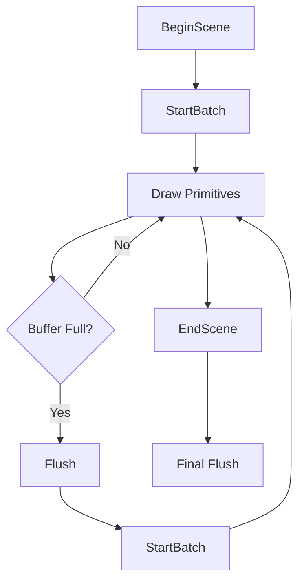

# Batch Rendering Algorithm

This document describes the implementation details of the 2D batch rendering algorithm in Zgine's rendering system.

## Overview

The batch rendering system is designed to maximize GPU utilization by grouping multiple rendering operations into single draw calls. This approach significantly reduces CPU-GPU communication overhead and improves rendering performance.

## Architecture Overview

### Core Components

1. **BatchRenderer2D**: Main rendering class
2. **Vertex Buffer**: Dynamic vertex data storage
3. **Index Buffer**: Pre-computed index patterns
4. **Texture Management**: Multi-texture slot system
5. **Shader System**: Unified shader for all primitives

### Rendering Pipeline



## Data Structures

### QuadVertex Structure

```cpp
struct QuadVertex
{
    glm::vec3 Position;    // 3D position
    glm::vec4 Color;       // RGBA color
    glm::vec2 TexCoord;    // Texture coordinates
    float TexIndex;        // Texture slot index
};
```

**Memory Layout**: 40 bytes per vertex
- Position: 12 bytes (3 × float)
- Color: 16 bytes (4 × float)
- TexCoord: 8 bytes (2 × float)
- TexIndex: 4 bytes (1 × float)

### RenderStats Structure

```cpp
struct RenderStats
{
    uint32_t DrawCalls = 0;    // Number of draw calls
    uint32_t QuadCount = 0;   // Number of quads rendered
    uint32_t VertexCount = 0; // Number of vertices processed
    uint32_t IndexCount = 0;   // Number of indices processed
};
```

## Batch Management

### Buffer Limits

```cpp
static const uint32_t MaxQuads = 10000;
static const uint32_t MaxVertices = MaxQuads * 4;  // 40,000
static const uint32_t MaxIndices = MaxQuads * 6;   // 60,000
static const uint32_t MaxTextureSlots = 32;
```

### Batch Lifecycle

1. **Initialization**: Allocate vertex buffer and generate index patterns
2. **Batch Start**: Reset counters and vertex pointer
3. **Primitive Addition**: Add vertices to buffer
4. **Batch Flush**: Upload data to GPU and render
5. **Cleanup**: Reset for next batch

## Index Pattern Generation

### Quad Index Pattern

Each quad uses 6 indices to form two triangles:

```
Triangle 1: (0, 1, 2)
Triangle 2: (2, 3, 0)
```

**Index Buffer Generation**:
```cpp
uint32_t offset = 0;
for (uint32_t i = 0; i < MaxIndices; i += 6)
{
    quadIndices[i + 0] = offset + 0;
    quadIndices[i + 1] = offset + 1;
    quadIndices[i + 2] = offset + 2;
    
    quadIndices[i + 3] = offset + 2;
    quadIndices[i + 4] = offset + 3;
    quadIndices[i + 5] = offset + 0;
    
    offset += 4;
}
```

## Texture Management

### Multi-Texture System

The system supports up to 32 textures per batch using texture arrays:

```cpp
uniform sampler2D u_Textures[32];
```

### Texture Slot Assignment

```cpp
float GetTextureIndex(const std::shared_ptr<Texture2D>& texture)
{
    // Check if texture is already bound
    for (uint32_t i = 1; i < s_TextureSlotIndex; i++)
    {
        if (s_TextureSlots[i] == texture)
            return (float)i;
    }
    
    // Bind new texture
    s_TextureSlots[s_TextureSlotIndex] = texture;
    return (float)s_TextureSlotIndex++;
}
```

## Primitive Rendering

### Quad Rendering

#### Basic Quad Algorithm

```cpp
void DrawQuadInternal(const glm::vec3& position, const glm::vec2& size, 
                     const glm::vec4& color, int entityID)
{
    // Transform matrix calculation
    glm::mat4 transform = glm::translate(glm::mat4(1.0f), position)
                         * glm::scale(glm::mat4(1.0f), { size.x, size.y, 1.0f });
    
    // Transform vertices
    for (size_t i = 0; i < 4; i++)
    {
        s_QuadVertexBufferPtr->Position = transform * s_QuadVertexPositions[i];
        s_QuadVertexBufferPtr->Color = color;
        s_QuadVertexBufferPtr->TexCoord = { 0.0f, 0.0f };
        s_QuadVertexBufferPtr->TexIndex = 0.0f; // White texture
        s_QuadVertexBufferPtr++;
    }
    
    s_QuadIndexCount += 6;
    s_Stats.QuadCount++;
}
```

#### Rotated Quad Algorithm

```cpp
void DrawRotatedQuadInternal(const glm::vec3& position, const glm::vec2& size, 
                            float rotation, const glm::vec4& color, int entityID)
{
    // Combined transformation matrix
    glm::mat4 transform = glm::translate(glm::mat4(1.0f), position)
                         * glm::rotate(glm::mat4(1.0f), rotation, {0.0f, 0.0f, 1.0f})
                         * glm::scale(glm::mat4(1.0f), { size.x, size.y, 1.0f });
    
    // Apply transformation to vertices
    for (size_t i = 0; i < 4; i++)
    {
        s_QuadVertexBufferPtr->Position = transform * s_QuadVertexPositions[i];
        s_QuadVertexBufferPtr->Color = color;
        s_QuadVertexBufferPtr->TexCoord = { 0.0f, 0.0f };
        s_QuadVertexBufferPtr->TexIndex = 0.0f;
        s_QuadVertexBufferPtr++;
    }
    
    s_QuadIndexCount += 6;
    s_Stats.QuadCount++;
}
```

### Line Rendering

Lines are rendered as rotated quads:

```cpp
void DrawLine(const glm::vec3& p0, const glm::vec3& p1, 
              const glm::vec4& color, float thickness)
{
    // Calculate line properties
    glm::vec3 direction = p1 - p0;
    float length = glm::length(direction);
    
    if (length < 0.001f) return; // Skip very short lines
    
    direction = glm::normalize(direction);
    float angle = atan2(direction.y, direction.x);
    glm::vec3 center = (p0 + p1) * 0.5f;
    glm::vec2 size(length, thickness);
    
    // Use rotated quad drawing
    DrawRotatedQuadInternal(center, size, angle, color, -1);
}
```

## Shader System

### Vertex Shader

```glsl
#version 330 core

layout(location = 0) in vec3 a_Position;
layout(location = 1) in vec4 a_Color;
layout(location = 2) in vec2 a_TexCoord;
layout(location = 3) in float a_TexIndex;

uniform mat4 u_ViewProjection;

out vec4 v_Color;
out vec2 v_TexCoord;
out float v_TexIndex;

void main()
{
    v_Color = a_Color;
    v_TexCoord = a_TexCoord;
    v_TexIndex = a_TexIndex;
    gl_Position = u_ViewProjection * vec4(a_Position, 1.0);
}
```

### Fragment Shader

```glsl
#version 330 core

layout(location = 0) out vec4 color;

in vec4 v_Color;
in vec2 v_TexCoord;
in float v_TexIndex;

uniform sampler2D u_Textures[32];

void main()
{
    color = texture(u_Textures[int(v_TexIndex)], v_TexCoord) * v_Color;
}
```

## Performance Optimization

### Batch Efficiency

1. **Minimize Draw Calls**: Group primitives into batches
2. **Texture Batching**: Use texture arrays for multiple textures
3. **Vertex Buffer Optimization**: Pre-allocate large buffers
4. **Index Reuse**: Pre-compute index patterns

### Memory Management

1. **Smart Pointers**: Automatic memory management
2. **Buffer Reuse**: Reuse vertex buffers across frames
3. **Texture Caching**: Cache frequently used textures
4. **Statistics Tracking**: Monitor memory usage

### GPU Utilization

1. **Vertex Shader Efficiency**: Minimize vertex shader complexity
2. **Fragment Shader Optimization**: Efficient texture sampling
3. **Draw Call Batching**: Reduce CPU-GPU communication
4. **State Management**: Minimize state changes

## Error Handling

### Buffer Overflow

```cpp
if (s_QuadIndexCount >= MaxIndices)
    NextBatch();
```

Automatically flushes current batch and starts new one.

### Texture Slot Overflow

```cpp
if (s_TextureSlotIndex >= MaxTextureSlots)
    NextBatch();
```

Prevents texture slot overflow by flushing batch.

### Invalid Parameters

- **Size Validation**: Clamp negative sizes to zero
- **Color Validation**: Clamp colors to [0,1] range
- **Segment Validation**: Clamp segments to reasonable range

## Statistics and Profiling

### Performance Metrics

- **Draw Calls**: Number of GPU draw calls
- **Primitive Count**: Number of rendered primitives
- **Vertex Count**: Number of processed vertices
- **Index Count**: Number of processed indices

### Profiling Tools

```cpp
// Get current statistics
auto stats = BatchRenderer2D::GetStats();
std::cout << "Draw Calls: " << stats.DrawCalls << std::endl;
std::cout << "Quads: " << stats.QuadCount << std::endl;

// Reset for next frame
BatchRenderer2D::ResetStats();
```

## Best Practices

### Rendering Order

1. **Opaque Primitives**: Render opaque objects first
2. **Transparent Primitives**: Render transparent objects last
3. **Texture Grouping**: Group primitives by texture
4. **State Minimization**: Minimize state changes

### Performance Tips

1. **Batch Similar Primitives**: Group similar rendering calls
2. **Reuse Textures**: Cache and reuse textures
3. **Monitor Statistics**: Track rendering performance
4. **Profile Regularly**: Use profiling tools

### Memory Management

1. **Smart Pointers**: Use RAII principles
2. **Buffer Pre-allocation**: Pre-allocate large buffers
3. **Texture Management**: Implement texture caching
4. **Cleanup**: Proper resource cleanup

## Future Enhancements

### Planned Features

1. **3D Batch Rendering**: Extend to 3D primitives
2. **Instanced Rendering**: Support for instanced rendering
3. **Compute Shaders**: GPU-based primitive generation
4. **Dynamic Batching**: Automatic batching optimization

### Performance Improvements

1. **Multi-threading**: Parallel batch processing
2. **GPU Culling**: Hardware-based culling
3. **LOD System**: Level-of-detail rendering
4. **Occlusion Culling**: Visibility optimization
