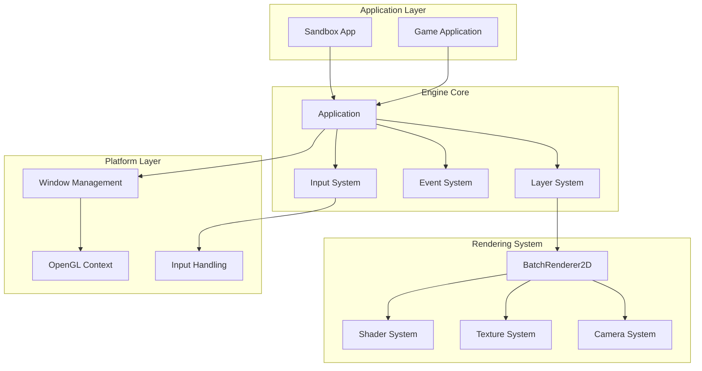
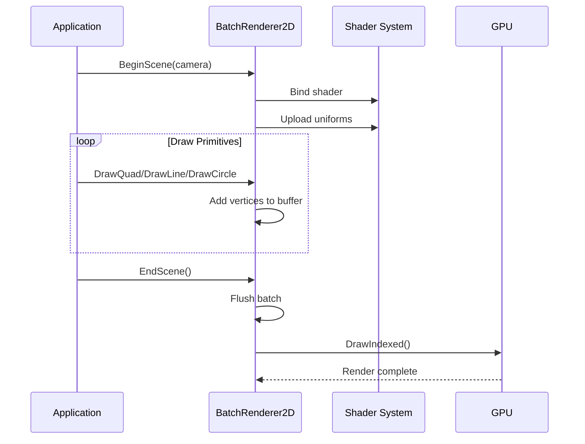
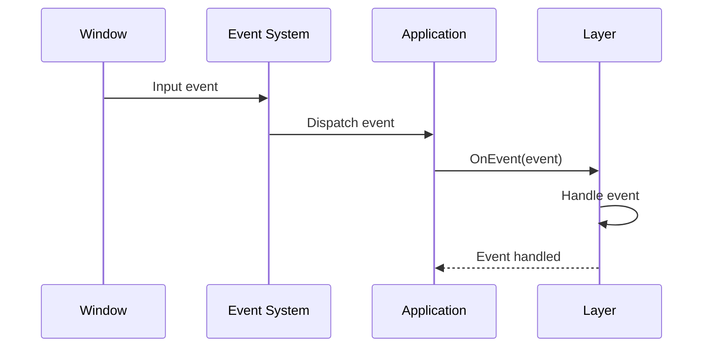

# Engine Architecture Overview

This document provides a comprehensive overview of the Zgine game engine architecture, including design principles, module organization, and system interactions.

## Design Principles

### Core Philosophy

Zgine is built on the following design principles:

1. **Modularity**: Clean separation of concerns with well-defined interfaces
2. **Performance**: High-performance rendering with modern C++ practices
3. **Simplicity**: Easy-to-use API with minimal complexity
4. **Extensibility**: Designed for easy extension and modification
5. **Memory Safety**: Modern C++ memory management with smart pointers

### Architecture Goals

- **Cross-platform Compatibility**: Windows, Linux, macOS support
- **High Performance**: Efficient rendering and resource management
- **Developer Friendly**: Clear APIs and comprehensive documentation
- **Maintainable**: Clean code structure and separation of concerns

## System Architecture

### High-Level Architecture



## Module Organization

### Core Modules

#### Application Module
- **Purpose**: Application lifecycle management
- **Components**: Application class, main loop, window management
- **Dependencies**: Platform layer, Event system

#### Layer System
- **Purpose**: Hierarchical application organization
- **Components**: Layer, LayerStack, Overlay management
- **Dependencies**: Event system

#### Event System
- **Purpose**: Decoupled communication between systems
- **Components**: Event, EventDispatcher, specific event types
- **Dependencies**: None (core system)

#### Input System
- **Purpose**: Cross-platform input handling
- **Components**: Input class, key/mouse event handling
- **Dependencies**: Platform layer, Event system

### Rendering Modules

#### BatchRenderer2D
- **Purpose**: High-performance 2D rendering
- **Components**: Batch rendering, primitive drawing, statistics
- **Dependencies**: Shader system, Texture system, Camera system

#### Shader System
- **Purpose**: Shader compilation and management
- **Components**: Shader class, uniform management
- **Dependencies**: OpenGL context

#### Texture System
- **Purpose**: Texture loading and management
- **Components**: Texture2D class, texture caching
- **Dependencies**: OpenGL context

#### Camera System
- **Purpose**: View and projection management
- **Components**: OrthographicCamera, matrix calculations
- **Dependencies**: GLM mathematics library

### Platform Modules

#### Window Management
- **Purpose**: Cross-platform window creation and management
- **Components**: Window class, platform-specific implementations
- **Dependencies**: GLFW library

#### OpenGL Context
- **Purpose**: OpenGL context management
- **Components**: GraphicsContext, OpenGL-specific implementations
- **Dependencies**: GLAD library

## Data Flow Architecture

### Rendering Pipeline



### Event Flow



## Memory Management Architecture

### Smart Pointer Strategy

The engine uses modern C++ smart pointers for automatic memory management:

```cpp
// Unique ownership
std::unique_ptr<Window> m_Window;
std::unique_ptr<ImGuiLayer> m_ImGuiLayer;

// Shared ownership
std::shared_ptr<Texture2D> texture;
std::shared_ptr<Shader> shader;

// Array management
std::unique_ptr<QuadVertex[]> s_QuadVertexBufferBase;
```

### RAII Principles

All resources follow RAII (Resource Acquisition Is Initialization) principles:

- **Automatic Cleanup**: Destructors handle resource cleanup
- **Exception Safety**: Resources are cleaned up even if exceptions occur
- **No Manual Management**: No explicit new/delete calls

### Memory Layout

#### Static Data
- **Global State**: Renderer statistics, singleton instances
- **Constants**: Buffer limits, shader sources
- **Configuration**: Engine settings

#### Dynamic Data
- **Vertex Buffers**: Dynamic vertex data
- **Texture Data**: Loaded texture information
- **Event Data**: Temporary event objects

## Threading Model

### Current Implementation
- **Single-threaded**: All operations on main thread
- **Event-driven**: Asynchronous event handling
- **Non-blocking**: Rendering doesn't block input

### Future Considerations
- **Multi-threading**: Parallel batch processing
- **Worker Threads**: Background resource loading
- **Thread Safety**: Synchronization mechanisms

## Extension Points

### Plugin Architecture

The engine is designed for easy extension:

#### Custom Layers
```cpp
class CustomLayer : public Zgine::Layer
{
public:
    virtual void OnUpdate() override;
    virtual void OnImGuiRender() override;
    virtual void OnEvent(Event& e) override;
};
```

#### Custom Renderers
```cpp
class CustomRenderer
{
public:
    virtual void BeginScene() = 0;
    virtual void EndScene() = 0;
    virtual void DrawPrimitive() = 0;
};
```

#### Custom Input Handlers
```cpp
class CustomInputHandler
{
public:
    virtual bool HandleKeyEvent(KeyEvent& e) = 0;
    virtual bool HandleMouseEvent(MouseEvent& e) = 0;
};
```

## Performance Architecture

### Rendering Performance

1. **Batch Rendering**: Minimize draw calls
2. **Texture Batching**: Multiple textures per batch
3. **Vertex Buffer Optimization**: Large pre-allocated buffers
4. **Index Reuse**: Pre-computed index patterns

### Memory Performance

1. **Smart Pointers**: Automatic memory management
2. **Buffer Reuse**: Reuse buffers across frames
3. **Texture Caching**: Cache frequently used textures
4. **Statistics Tracking**: Monitor memory usage

### CPU Performance

1. **Event System**: Efficient event dispatching
2. **Layer System**: Minimal overhead layer management
3. **Input Handling**: Direct input processing
4. **Statistics**: Minimal performance impact

## Security Considerations

### Memory Safety
- **Smart Pointers**: Prevent memory leaks
- **RAII**: Automatic resource cleanup
- **Bounds Checking**: Array bounds validation
- **Exception Safety**: Safe exception handling

### Input Validation
- **Parameter Validation**: Validate all input parameters
- **Range Checking**: Clamp values to valid ranges
- **Error Handling**: Graceful error handling

## Testing Architecture

### Unit Testing
- **Module Testing**: Individual module testing
- **Integration Testing**: Module interaction testing
- **Performance Testing**: Rendering performance testing

### Test Structure
```
tests/
├── unit/           # Unit tests
├── integration/    # Integration tests
├── performance/    # Performance tests
└── fixtures/       # Test data and fixtures
```

## Documentation Architecture

### Documentation Structure
```
docs/
├── api/            # API reference
├── architecture/   # Architecture documentation
├── algorithms/     # Algorithm documentation
├── guides/         # Developer guides
└── examples/       # Code examples
```

### Documentation Standards
- **API Documentation**: OpenAPI 3.0 specification
- **Code Examples**: C++ and usage examples
- **Architecture Diagrams**: Mermaid diagrams
- **Version Control**: Documentation versioned with code

## Future Architecture Plans

### Planned Modules

#### 3D Rendering System
- **3D Batch Renderer**: Extend to 3D primitives
- **3D Camera System**: Perspective camera support
- **3D Transformations**: 3D matrix operations

#### Physics System
- **Box2D Integration**: 2D physics support
- **Bullet3D Integration**: 3D physics support
- **Collision Detection**: Efficient collision detection

#### Audio System
- **OpenAL Integration**: 3D audio support
- **Audio Sources**: Sound source management
- **Audio Effects**: Reverb, echo, etc.

#### Scripting System
- **Lua Integration**: Scripting support
- **C++ Bindings**: Native function binding
- **Hot Reloading**: Runtime script reloading

### Architecture Evolution

1. **Modular Design**: Maintain modular architecture
2. **Plugin System**: Extensible plugin architecture
3. **Multi-threading**: Parallel processing support
4. **Cross-platform**: Enhanced platform support
