# Zgine 引擎 UML 类图

## 核心架构类图

## 渲染系统详细类图

## 事件系统类图

```mermaid
classDiagram
    %% 事件基类
    class Event {
        <<abstract>>
        -bool m_Handled
        +GetEventType() EventType*
        +GetName() char**
        +GetCategoryFlags() int*
        +ToString() string
        +IsInCategory(EventCategory) bool
        +Handled() bool
    }

    class EventDispatcher {
        -Event& m_Event
        +EventDispatcher(Event&)
        +Dispatch~T~(EventFn~T~) bool
    }

    %% 应用事件
    class WindowCloseEvent {
        +GetStaticType() EventType
        +GetEventType() EventType
        +GetName() char*
        +GetCategoryFlags() int
        +ToString() string
    }

    class WindowResizeEvent {
        -uint32_t m_Width
        -uint32_t m_Height
        +WindowResizeEvent(uint32_t, uint32_t)
        +GetWidth() uint32_t
        +GetHeight() uint32_t
        +GetStaticType() EventType
        +GetEventType() EventType
        +GetName() char*
        +GetCategoryFlags() int
        +ToString() string
    }

    class WindowFocusEvent {
        +GetStaticType() EventType
        +GetEventType() EventType
        +GetName() char*
        +GetCategoryFlags() int
        +ToString() string
    }

    class WindowLostFocusEvent {
        +GetStaticType() EventType
        +GetEventType() EventType
        +GetName() char*
        +GetCategoryFlags() int
        +ToString() string
    }

    class WindowMovedEvent {
        -uint32_t m_X
        -uint32_t m_Y
        +WindowMovedEvent(uint32_t, uint32_t)
        +GetX() uint32_t
        +GetY() uint32_t
        +GetStaticType() EventType
        +GetEventType() EventType
        +GetName() char*
        +GetCategoryFlags() int
        +ToString() string
    }

    class AppTickEvent {
        +GetStaticType() EventType
        +GetEventType() EventType
        +GetName() char*
        +GetCategoryFlags() int
        +ToString() string
    }

    class AppUpdateEvent {
        +GetStaticType() EventType
        +GetEventType() EventType
        +GetName() char*
        +GetCategoryFlags() int
        +ToString() string
    }

    class AppRenderEvent {
        +GetStaticType() EventType
        +GetEventType() EventType
        +GetName() char*
        +GetCategoryFlags() int
        +ToString() string
    }

    %% 键盘事件
    class KeyPressedEvent {
        -int m_KeyCode
        -int m_RepeatCount
        +KeyPressedEvent(int, int)
        +GetKeyCode() int
        +GetRepeatCount() int
        +GetStaticType() EventType
        +GetEventType() EventType
        +GetName() char*
        +GetCategoryFlags() int
        +ToString() string
    }

    class KeyReleasedEvent {
        -int m_KeyCode
        +KeyReleasedEvent(int)
        +GetKeyCode() int
        +GetStaticType() EventType
        +GetEventType() EventType
        +GetName() char*
        +GetCategoryFlags() int
        +ToString() string
    }

    class KeyTypedEvent {
        -int m_KeyCode
        +KeyTypedEvent(int)
        +GetKeyCode() int
        +GetStaticType() EventType
        +GetEventType() EventType
        +GetName() char*
        +GetCategoryFlags() int
        +ToString() string
    }

    %% 鼠标事件
    class MouseButtonPressedEvent {
        -int m_Button
        +MouseButtonPressedEvent(int)
        +GetMouseButton() int
        +GetStaticType() EventType
        +GetEventType() EventType
        +GetName() char*
        +GetCategoryFlags() int
        +ToString() string
    }

    class MouseButtonReleasedEvent {
        -int m_Button
        +MouseButtonReleasedEvent(int)
        +GetMouseButton() int
        +GetStaticType() EventType
        +GetEventType() EventType
        +GetName() char*
        +GetCategoryFlags() int
        +ToString() string
    }

    class MouseMovedEvent {
        -float m_MouseX
        -float m_MouseY
        +MouseMovedEvent(float, float)
        +GetX() float
        +GetY() float
        +GetStaticType() EventType
        +GetEventType() EventType
        +GetName() char*
        +GetCategoryFlags() int
        +ToString() string
    }

    class MouseScrolledEvent {
        -float m_XOffset
        -float m_YOffset
        +MouseScrolledEvent(float, float)
        +GetXOffset() float
        +GetYOffset() float
        +GetStaticType() EventType
        +GetEventType() EventType
        +GetName() char*
        +GetCategoryFlags() int
        +ToString() string
    }

    %% 关系定义
    Event <|-- WindowCloseEvent : implements
    Event <|-- WindowResizeEvent : implements
    Event <|-- WindowFocusEvent : implements
    Event <|-- WindowLostFocusEvent : implements
    Event <|-- WindowMovedEvent : implements
    Event <|-- AppTickEvent : implements
    Event <|-- AppUpdateEvent : implements
    Event <|-- AppRenderEvent : implements
    Event <|-- KeyPressedEvent : implements
    Event <|-- KeyReleasedEvent : implements
    Event <|-- KeyTypedEvent : implements
    Event <|-- MouseButtonPressedEvent : implements
    Event <|-- MouseButtonReleasedEvent : implements
    Event <|-- MouseMovedEvent : implements
    Event <|-- MouseScrolledEvent : implements
    
    EventDispatcher --> Event : dispatches
```

## 平台抽象层类图

## 性能监控系统类图

## 总结

Zgine 引擎采用了现代化的 C++ 设计模式，具有以下特点：

1. **分层架构**: 清晰的层次结构，每层职责明确
2. **平台抽象**: 通过接口实现跨平台支持
3. **事件驱动**: 基于事件系统的松耦合设计
4. **模块化**: 各功能模块独立，便于维护和扩展
5. **性能优化**: 内置批处理渲染、内存池、剔除系统等优化
6. **可扩展性**: 支持插件系统和多渲染 API

该架构设计为游戏开发提供了坚实的基础，支持 2D 和 3D 渲染，具有良好的性能和可维护性。
