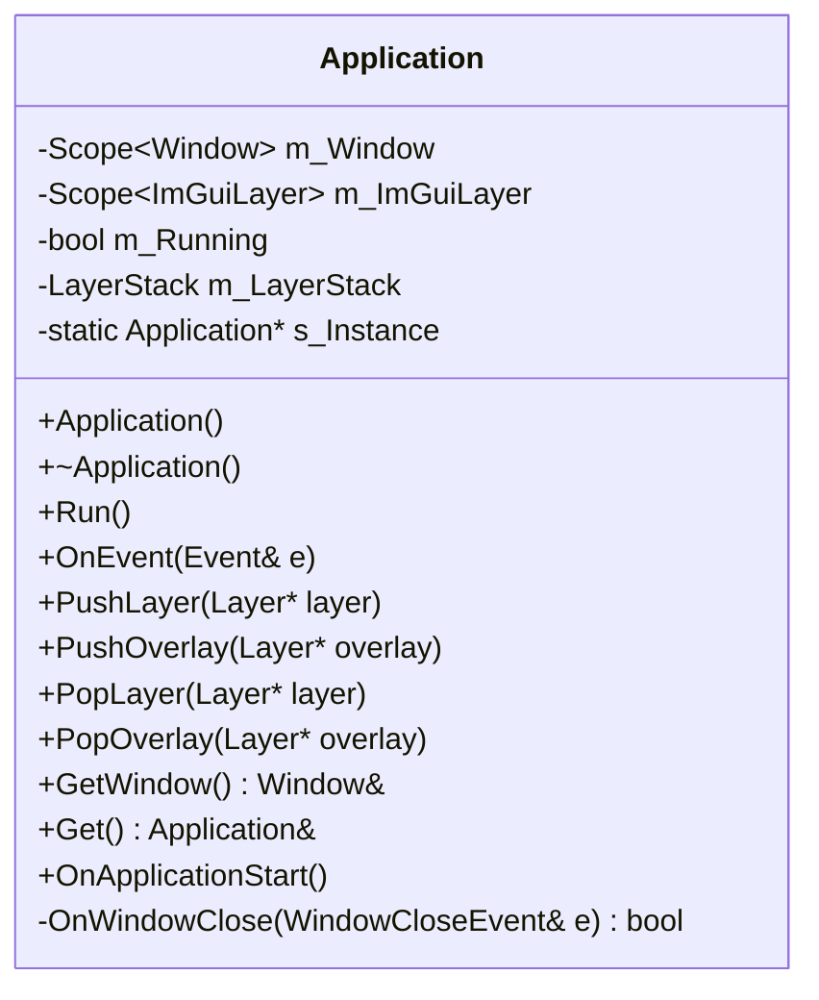
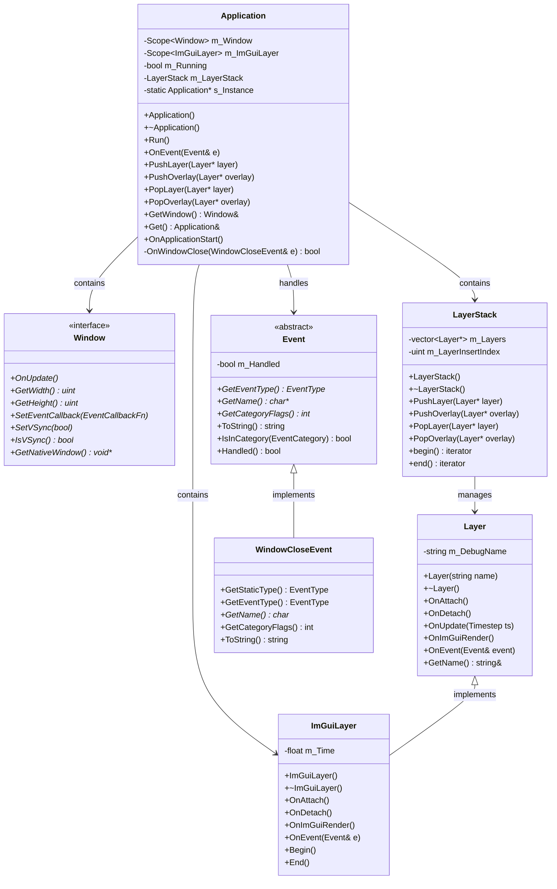

# Application 类 UML 图

## Application 类详细结构

## Application 类关系图

## Application 类说明

### 职责
- **应用程序生命周期管理**: 管理整个引擎的启动、运行和关闭
- **窗口管理**: 创建和管理主窗口
- **层栈管理**: 管理应用程序层的添加、移除和执行顺序
- **事件处理**: 处理应用程序级别的事件
- **ImGui集成**: 管理调试界面层

### 设计模式
- **单例模式**: 通过静态实例确保全局唯一性
- **工厂模式**: 通过CreateApplication()工厂函数创建实例

### 关键特性
- **线程安全**: 单例实现确保线程安全
- **资源管理**: 使用智能指针管理资源
- **事件驱动**: 基于事件系统的松耦合设计
- **可扩展性**: 通过层系统支持插件和扩展
