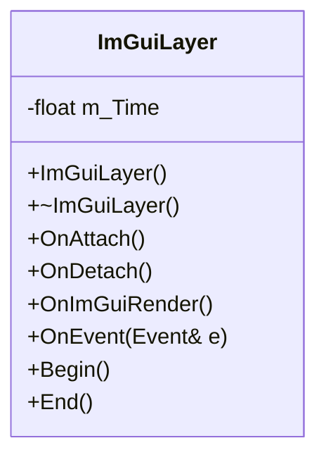
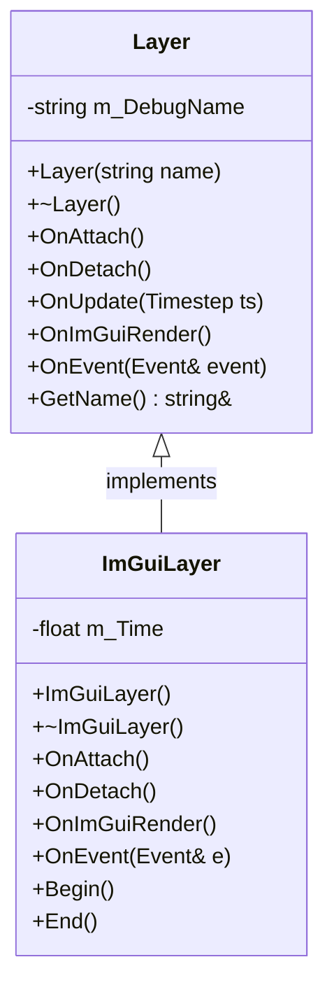
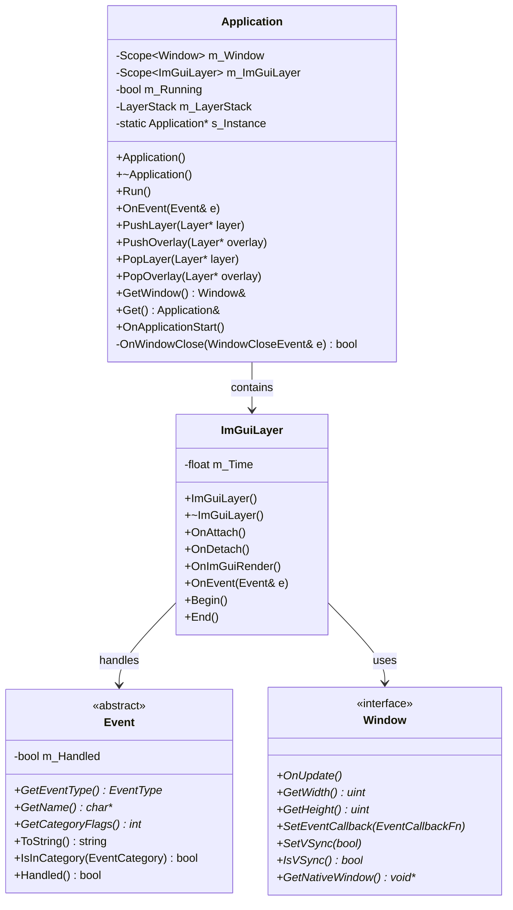
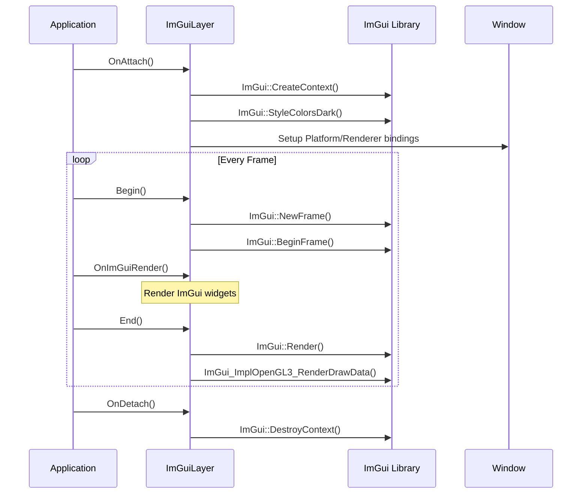

# ImGuiLayer 类 UML 图

## ImGuiLayer 类详细结构

## ImGuiLayer 类继承关系图

## ImGuiLayer 类关系图

## ImGuiLayer 生命周期图

## ImGuiLayer 类说明

### 职责
- **ImGui集成**: 管理ImGui库的初始化和清理
- **调试界面**: 提供调试和开发工具界面
- **事件处理**: 处理ImGui相关的事件
- **渲染管理**: 管理ImGui的渲染循环

### 设计模式
- **适配器模式**: 适配ImGui库到引擎的层系统
- **单例模式**: 通常作为全局唯一的调试层

### 生命周期方法
- **OnAttach()**: 初始化ImGui上下文和平台绑定
- **OnDetach()**: 清理ImGui上下文和资源
- **OnImGuiRender()**: 渲染ImGui调试界面
- **OnEvent()**: 处理ImGui相关事件
- **Begin()**: 开始ImGui帧
- **End()**: 结束ImGui帧并渲染

### 关键特性
- **平台无关**: 支持多种平台的ImGui集成
- **渲染优化**: 高效的ImGui渲染管道
- **事件处理**: 完整的鼠标键盘事件支持
- **调试友好**: 提供丰富的调试工具和界面
- **性能监控**: 内置性能监控和统计功能
