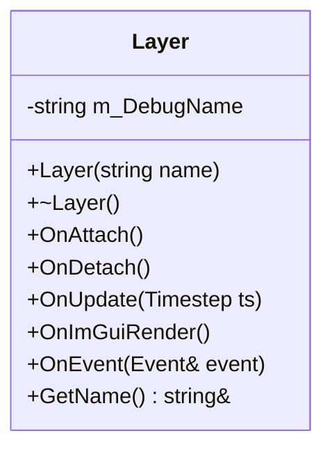
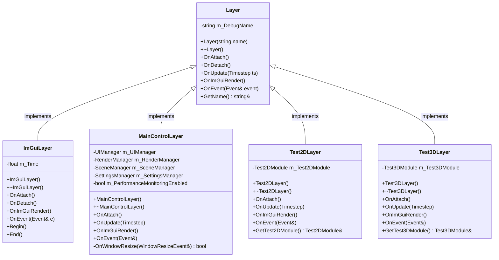
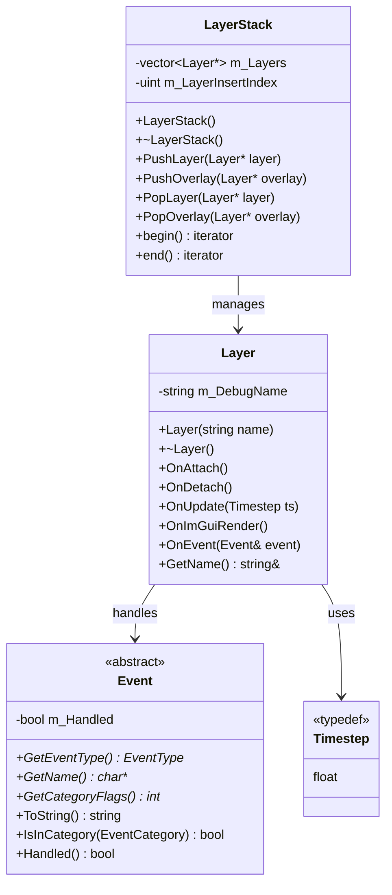

# Layer 类 UML 图

## Layer 类详细结构

## Layer 类继承关系图

## Layer 类与相关类关系图

## Layer 类说明

### 职责
- **生命周期管理**: 提供层的附加、分离、更新和渲染生命周期
- **事件处理**: 处理传递给层的事件
- **调试支持**: 提供调试名称用于识别
- **ImGui集成**: 支持ImGui调试界面渲染

### 设计模式
- **模板方法模式**: 定义算法骨架，子类实现具体步骤
- **观察者模式**: 通过事件系统响应事件

### 生命周期方法
- **OnAttach()**: 层被添加到层栈时调用
- **OnDetach()**: 层从层栈移除时调用
- **OnUpdate()**: 每帧更新时调用
- **OnImGuiRender()**: ImGui渲染时调用
- **OnEvent()**: 事件发生时调用

### 关键特性
- **抽象基类**: 提供统一的接口
- **虚函数**: 支持多态和重写
- **事件驱动**: 支持事件处理
- **调试友好**: 提供调试名称
