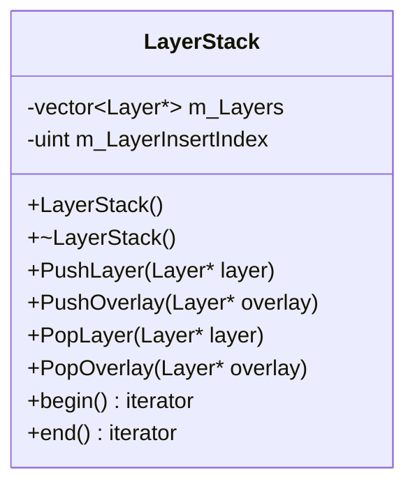
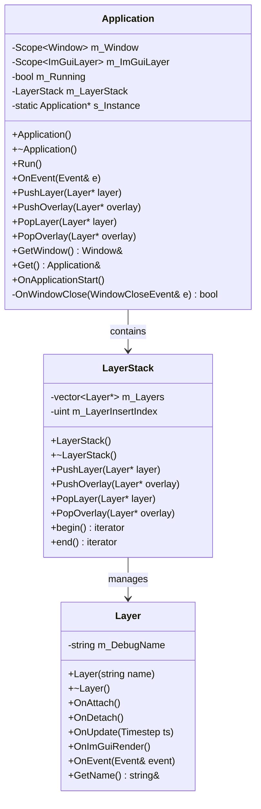
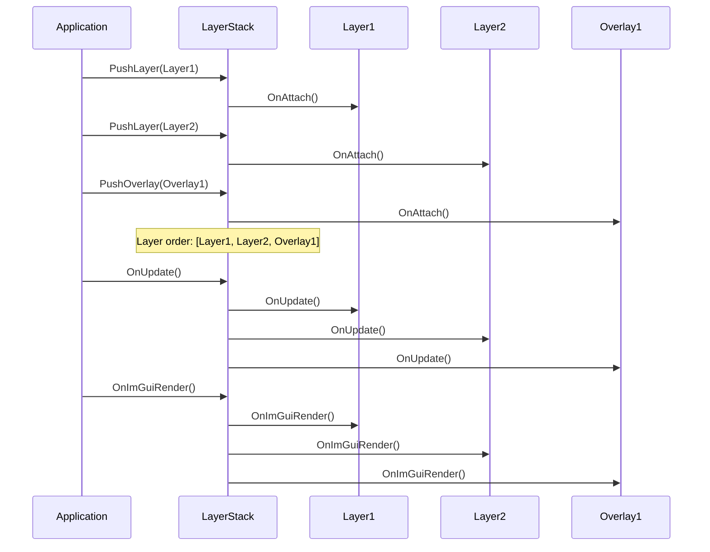

# LayerStack 类 UML 图

## LayerStack 类详细结构

## LayerStack 类关系图

## LayerStack 执行顺序图

## LayerStack 类说明

### 职责
- **层管理**: 管理应用程序层的添加、移除和执行顺序
- **执行顺序**: 确保层和覆盖层按正确顺序执行
- **生命周期**: 管理层的生命周期方法调用
- **迭代支持**: 提供迭代器支持遍历层

### 设计模式
- **组合模式**: 管理Layer对象的集合
- **迭代器模式**: 提供begin()和end()迭代器

### 层类型
- **Layer**: 普通层，在覆盖层之前执行
- **Overlay**: 覆盖层，在普通层之后执行，通常用于UI

### 执行顺序
1. **OnUpdate()**: 按层顺序执行 (Layer1 → Layer2 → Overlay1)
2. **OnImGuiRender()**: 按层顺序执行 (Layer1 → Layer2 → Overlay1)
3. **OnEvent()**: 按层顺序执行，事件被处理后停止传播

### 关键特性
- **插入索引**: 使用m_LayerInsertIndex跟踪层插入位置
- **自动清理**: 析构函数自动清理所有层
- **类型安全**: 使用模板和迭代器确保类型安全
- **性能优化**: 使用vector提供高效的随机访问
