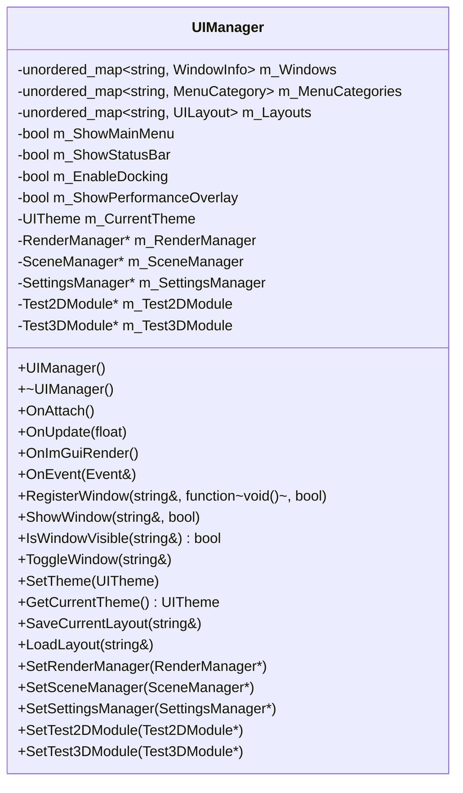
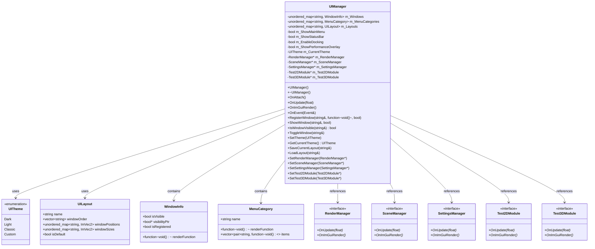
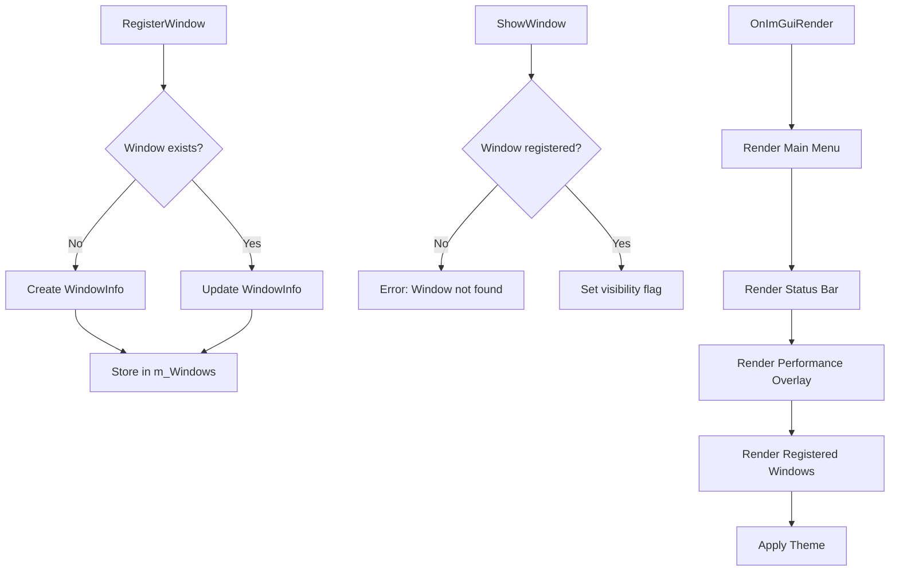

# UIManager 类 UML 图

## UIManager 类详细结构

## UIManager 类关系图

## UIManager 窗口管理流程图

## UIManager 类说明

### 职责
- **窗口管理**: 管理ImGui窗口的注册、显示和隐藏
- **菜单管理**: 管理主菜单和子菜单的创建和组织
- **主题管理**: 管理UI主题的切换和应用
- **布局管理**: 管理窗口布局的保存和加载
- **性能监控**: 提供性能监控UI界面

### 设计模式
- **管理器模式**: 统一管理UI相关功能
- **观察者模式**: 通过回调函数响应UI事件
- **策略模式**: 支持不同的UI主题策略

### 核心功能
- **窗口注册**: 动态注册和注销ImGui窗口
- **菜单系统**: 创建层次化的菜单结构
- **主题切换**: 支持多种UI主题
- **布局保存**: 保存和恢复窗口布局
- **性能显示**: 显示引擎性能统计

### 关键特性
- **动态性**: 支持运行时动态添加/移除窗口
- **可配置**: 支持多种UI配置选项
- **扩展性**: 易于扩展新的UI功能
- **性能优化**: 高效的UI渲染和更新
- **用户友好**: 提供直观的调试界面
