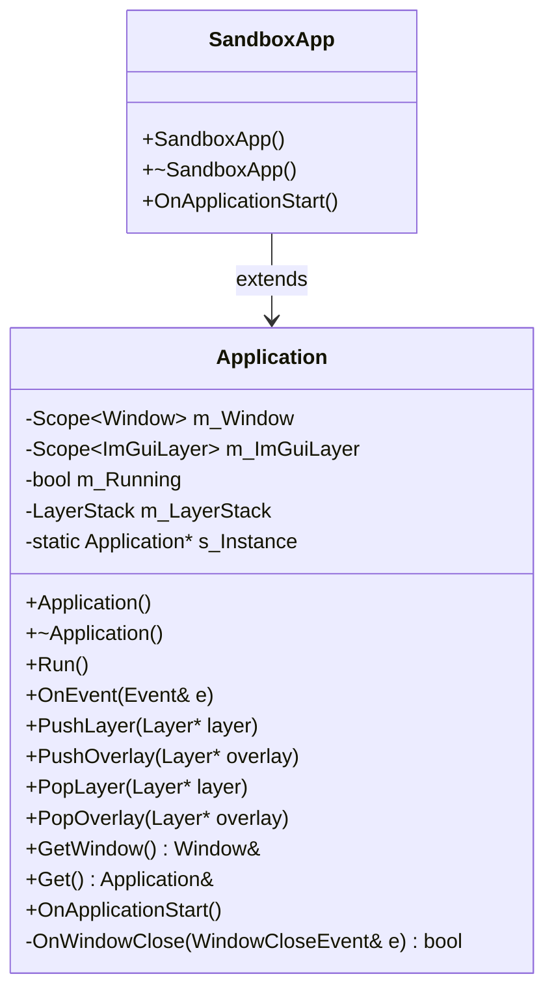
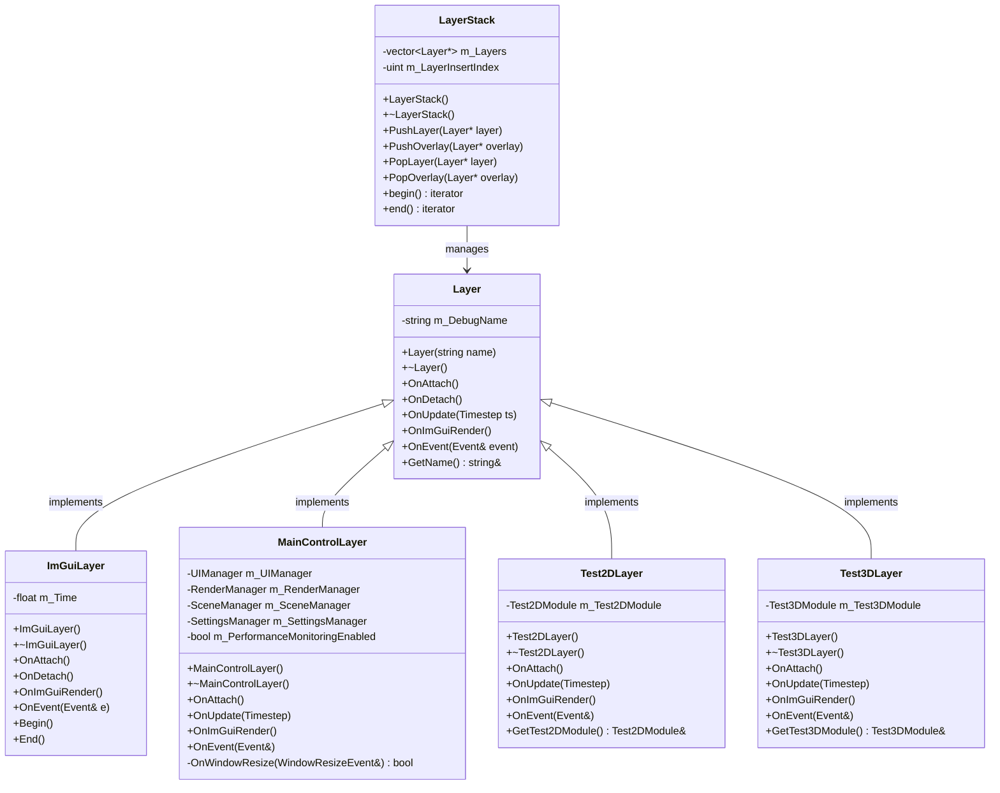
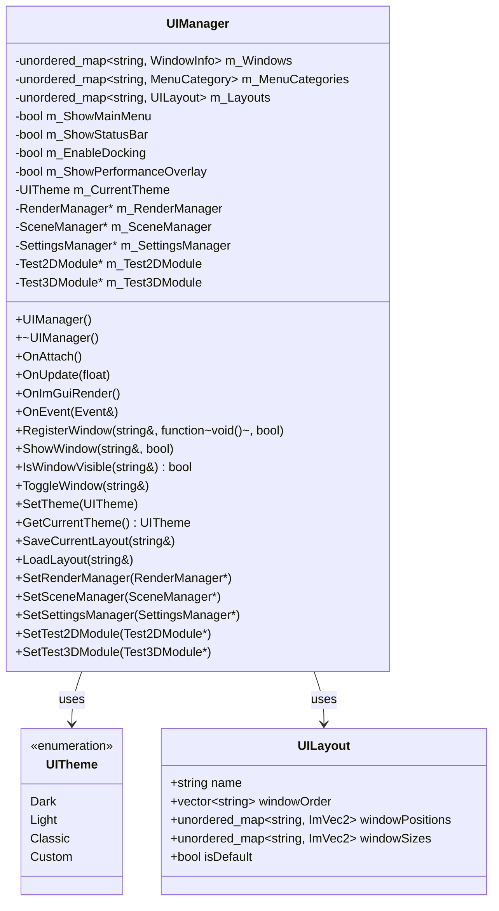

# 核心架构 UML 类图

## Application 类图

```mermaid
classDiagram
    class Application {
        -Scope~Window~ m_Window
        -Scope~ImGuiLayer~ m_ImGuiLayer
        -bool m_Running
        -LayerStack m_LayerStack
        -static Application* s_Instance
        +Application()
        +~Application()
        +Run()
        +OnEvent(Event& e)
        +PushLayer(Layer* layer)
        +PushOverlay(Layer* overlay)
        +PopLayer(Layer* layer)
        +PopOverlay(Layer* overlay)
        +GetWindow() Window&
        +Get() Application&
        +OnApplicationStart()
        -OnWindowClose(WindowCloseEvent& e) bool
    }

    class SandboxApp {
        +SandboxApp()
        +~SandboxApp()
        +OnApplicationStart()
    }

    SandboxApp --> Application : extends
```

## Layer 系统类图

```mermaid
classDiagram
    class Layer {
        -string m_DebugName
        +Layer(string name)
        +~Layer()
        +OnAttach()
        +OnDetach()
        +OnUpdate(Timestep ts)
        +OnImGuiRender()
        +OnEvent(Event& event)
        +GetName() string&
    }

    class LayerStack {
        -vector~Layer*~ m_Layers
        -uint m_LayerInsertIndex
        +LayerStack()
        +~LayerStack()
        +PushLayer(Layer* layer)
        +PushOverlay(Layer* overlay)
        +PopLayer(Layer* layer)
        +PopOverlay(Layer* overlay)
        +begin() iterator
        +end() iterator
    }

    class ImGuiLayer {
        -float m_Time
        +ImGuiLayer()
        +~ImGuiLayer()
        +OnAttach()
        +OnDetach()
        +OnImGuiRender()
        +OnEvent(Event& e)
        +Begin()
        +End()
    }

    class MainControlLayer {
        -UIManager m_UIManager
        -RenderManager m_RenderManager
        -SceneManager m_SceneManager
        -SettingsManager m_SettingsManager
        -bool m_PerformanceMonitoringEnabled
        +MainControlLayer()
        +~MainControlLayer()
        +OnAttach()
        +OnUpdate(Timestep)
        +OnImGuiRender()
        +OnEvent(Event&)
        -OnWindowResize(WindowResizeEvent&) bool
    }

    class Test2DLayer {
        -Test2DModule m_Test2DModule
        +Test2DLayer()
        +~Test2DLayer()
        +OnAttach()
        +OnUpdate(Timestep)
        +OnImGuiRender()
        +OnEvent(Event&)
        +GetTest2DModule() Test2DModule&
    }

    class Test3DLayer {
        -Test3DModule m_Test3DModule
        +Test3DLayer()
        +~Test3DLayer()
        +OnAttach()
        +OnUpdate(Timestep)
        +OnImGuiRender()
        +OnEvent(Event&)
        +GetTest3DModule() Test3DModule&
    }

    Layer <|-- ImGuiLayer : implements
    Layer <|-- MainControlLayer : implements
    Layer <|-- Test2DLayer : implements
    Layer <|-- Test3DLayer : implements
    LayerStack --> Layer : manages
```

## UI 管理类图

```mermaid
classDiagram
    class UIManager {
        -unordered_map~string, WindowInfo~ m_Windows
        -unordered_map~string, MenuCategory~ m_MenuCategories
        -unordered_map~string, UILayout~ m_Layouts
        -bool m_ShowMainMenu
        -bool m_ShowStatusBar
        -bool m_EnableDocking
        -bool m_ShowPerformanceOverlay
        -UITheme m_CurrentTheme
        -RenderManager* m_RenderManager
        -SceneManager* m_SceneManager
        -SettingsManager* m_SettingsManager
        -Test2DModule* m_Test2DModule
        -Test3DModule* m_Test3DModule
        +UIManager()
        +~UIManager()
        +OnAttach()
        +OnUpdate(float)
        +OnImGuiRender()
        +OnEvent(Event&)
        +RegisterWindow(string&, function~void()~, bool)
        +ShowWindow(string&, bool)
        +IsWindowVisible(string&) bool
        +ToggleWindow(string&)
        +SetTheme(UITheme)
        +GetCurrentTheme() UITheme
        +SaveCurrentLayout(string&)
        +LoadLayout(string&)
        +SetRenderManager(RenderManager*)
        +SetSceneManager(SceneManager*)
        +SetSettingsManager(SettingsManager*)
        +SetTest2DModule(Test2DModule*)
        +SetTest3DModule(Test3DModule*)
    }

    class UITheme {
        <<enumeration>>
        Dark
        Light
        Classic
        Custom
    }

    class UILayout {
        +string name
        +vector~string~ windowOrder
        +unordered_map~string, ImVec2~ windowPositions
        +unordered_map~string, ImVec2~ windowSizes
        +bool isDefault
    }

    UIManager --> UITheme : uses
    UIManager --> UILayout : uses
```

## 核心架构关系图

```mermaid
classDiagram
    class Application {
        -Scope~Window~ m_Window
        -Scope~ImGuiLayer~ m_ImGuiLayer
        -bool m_Running
        -LayerStack m_LayerStack
        -static Application* s_Instance
        +Application()
        +~Application()
        +Run()
        +OnEvent(Event& e)
        +PushLayer(Layer* layer)
        +PushOverlay(Layer* overlay)
        +PopLayer(Layer* layer)
        +PopOverlay(Layer* overlay)
        +GetWindow() Window&
        +Get() Application&
        +OnApplicationStart()
        -OnWindowClose(WindowCloseEvent& e) bool
    }

    class LayerStack {
        -vector~Layer*~ m_Layers
        -uint m_LayerInsertIndex
        +LayerStack()
        +~LayerStack()
        +PushLayer(Layer* layer)
        +PushOverlay(Layer* overlay)
        +PopLayer(Layer* layer)
        +PopOverlay(Layer* overlay)
        +begin() iterator
        +end() iterator
    }

    class Layer {
        -string m_DebugName
        +Layer(string name)
        +~Layer()
        +OnAttach()
        +OnDetach()
        +OnUpdate(Timestep ts)
        +OnImGuiRender()
        +OnEvent(Event& event)
        +GetName() string&
    }

    class ImGuiLayer {
        -float m_Time
        +ImGuiLayer()
        +~ImGuiLayer()
        +OnAttach()
        +OnDetach()
        +OnImGuiRender()
        +OnEvent(Event& e)
        +Begin()
        +End()
    }

    class MainControlLayer {
        -UIManager m_UIManager
        -RenderManager m_RenderManager
        -SceneManager m_SceneManager
        -SettingsManager m_SettingsManager
        -bool m_PerformanceMonitoringEnabled
        +MainControlLayer()
        +~MainControlLayer()
        +OnAttach()
        +OnUpdate(Timestep)
        +OnImGuiRender()
        +OnEvent(Event&)
        -OnWindowResize(WindowResizeEvent&) bool
    }

    class UIManager {
        -unordered_map~string, WindowInfo~ m_Windows
        -unordered_map~string, MenuCategory~ m_MenuCategories
        -unordered_map~string, UILayout~ m_Layouts
        -bool m_ShowMainMenu
        -bool m_ShowStatusBar
        -bool m_EnableDocking
        -bool m_ShowPerformanceOverlay
        -UITheme m_CurrentTheme
        -RenderManager* m_RenderManager
        -SceneManager* m_SceneManager
        -SettingsManager* m_SettingsManager
        -Test2DModule* m_Test2DModule
        -Test3DModule* m_Test3DModule
        +UIManager()
        +~UIManager()
        +OnAttach()
        +OnUpdate(float)
        +OnImGuiRender()
        +OnEvent(Event&)
        +RegisterWindow(string&, function~void()~, bool)
        +ShowWindow(string&, bool)
        +IsWindowVisible(string&) bool
        +ToggleWindow(string&)
        +SetTheme(UITheme)
        +GetCurrentTheme() UITheme
        +SaveCurrentLayout(string&)
        +LoadLayout(string&)
        +SetRenderManager(RenderManager*)
        +SetSceneManager(SceneManager*)
        +SetSettingsManager(SettingsManager*)
        +SetTest2DModule(Test2DModule*)
        +SetTest3DModule(Test3DModule*)
    }

    Application --> LayerStack : contains
    Application --> ImGuiLayer : contains
    LayerStack --> Layer : manages
    Layer <|-- ImGuiLayer : implements
    Layer <|-- MainControlLayer : implements
    MainControlLayer --> UIManager : contains
```
