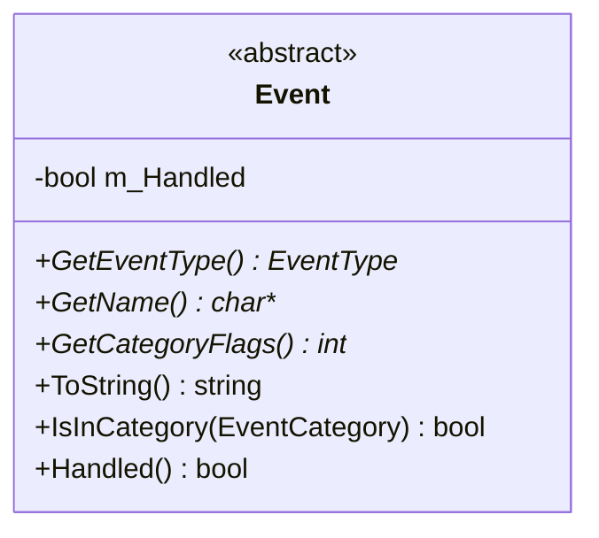
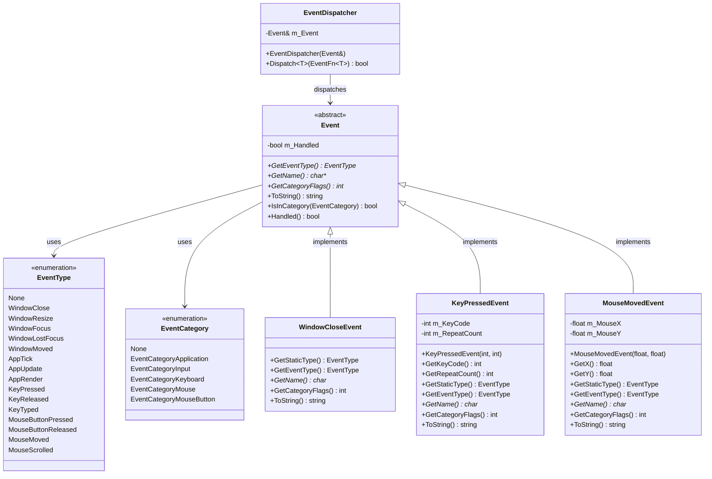

# Event 类 UML 图

## Event 类详细结构



## Event 类关系图



## Event 处理流程图

```mermaid
sequenceDiagram
    participant Win as Window
    participant App as Application
    participant ED as EventDispatcher
    participant E as Event
    participant L as Layer

    Win->>App: Window Event Occurs
    App->>ED: EventDispatcher(event)
    ED->>E: Check Event Type
    
    loop For Each Layer
        App->>L: OnEvent(event)
        L->>E: Check if Handled
        
        alt Event Handled
            E->>E: Set m_Handled = true
            L-->>App: Event Handled
            break
        else Event Not Handled
            L-->>App: Continue Processing
        end
    end
    
    alt Event Not Handled
        App->>App: Default Event Handling
    end
```

## Event 类说明

### 职责
- **事件抽象**: 提供所有事件类型的抽象基类
- **类型识别**: 提供事件类型和名称的识别
- **分类管理**: 支持事件分类和过滤
- **状态跟踪**: 跟踪事件是否已被处理

### 设计模式
- **抽象工厂模式**: 通过宏定义生成事件类型信息
- **观察者模式**: 支持事件监听和处理
- **状态模式**: 跟踪事件处理状态

### 事件分类
- **Application**: 应用程序级别事件
- **Input**: 输入相关事件
- **Keyboard**: 键盘事件
- **Mouse**: 鼠标事件
- **MouseButton**: 鼠标按键事件

### 关键特性
- **类型安全**: 通过模板和宏确保类型安全
- **性能优化**: 高效的类型检查和分发
- **可扩展性**: 易于添加新的事件类型
- **调试友好**: 提供详细的事件信息
- **状态管理**: 支持事件处理状态跟踪

### 事件处理机制
1. **事件创建**: 由系统或用户创建事件
2. **事件分发**: 通过EventDispatcher分发事件
3. **事件处理**: 由Layer或其他处理器处理事件
4. **状态更新**: 更新事件处理状态
5. **传播控制**: 根据处理状态决定是否继续传播
