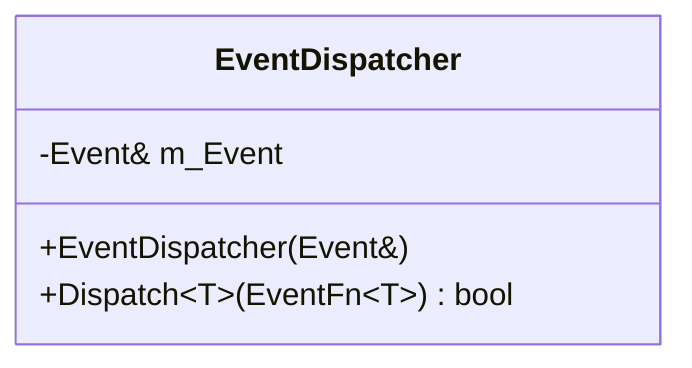
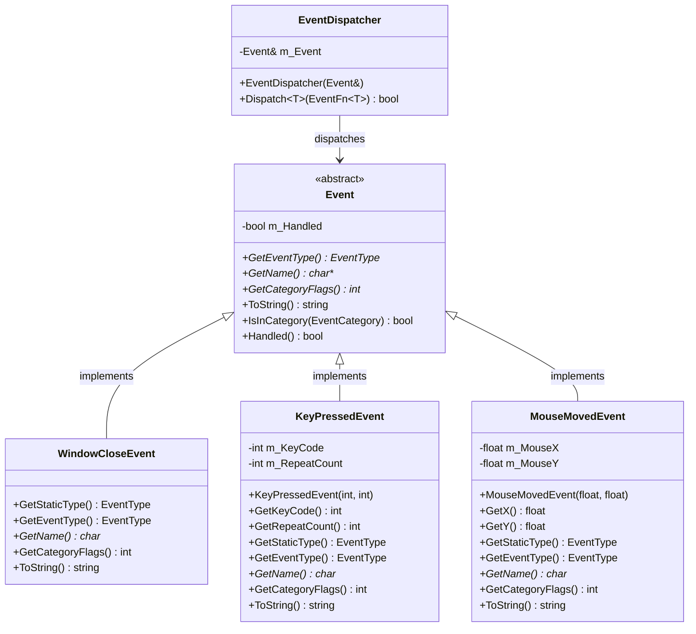
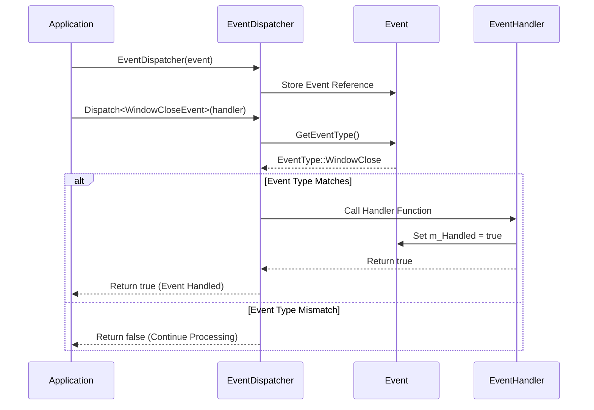
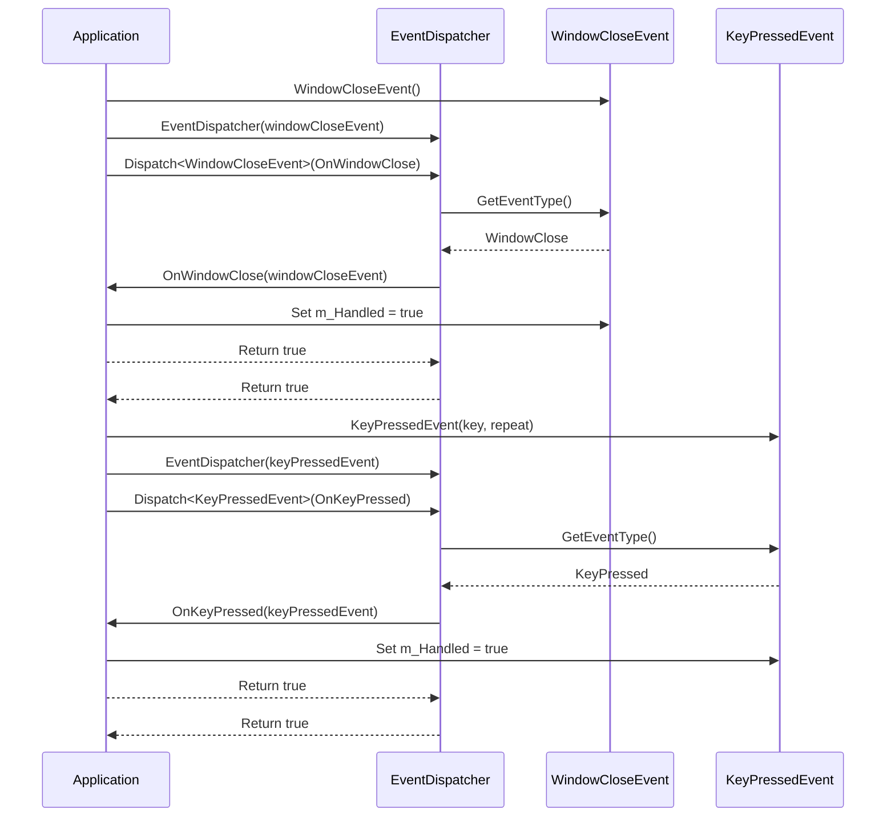

# EventDispatcher 类 UML 图

## EventDispatcher 类详细结构



## EventDispatcher 类关系图



## EventDispatcher 分发流程图



## EventDispatcher 使用示例



## EventDispatcher 类说明

### 职责
- **事件分发**: 将事件分发给相应的处理器
- **类型匹配**: 确保事件类型与处理器类型匹配
- **状态管理**: 跟踪事件处理状态
- **性能优化**: 高效的事件分发机制

### 设计模式
- **分发器模式**: 统一的事件分发机制
- **模板模式**: 使用模板确保类型安全
- **引用模式**: 通过引用避免事件拷贝

### 核心功能
- **类型检查**: 在编译时检查事件类型匹配
- **函数调用**: 调用匹配的事件处理函数
- **状态更新**: 更新事件处理状态
- **返回值处理**: 根据处理结果决定是否继续传播

### 关键特性
- **类型安全**: 编译时类型检查
- **性能优化**: 避免不必要的类型转换
- **简洁接口**: 简单的分发接口
- **状态跟踪**: 自动跟踪事件处理状态

### 使用示例
```cpp
// 创建事件分发器
EventDispatcher dispatcher(event);

// 分发窗口关闭事件
dispatcher.Dispatch<WindowCloseEvent>(BIND_EVENT_FN(OnWindowClose));

// 分发键盘事件
dispatcher.Dispatch<KeyPressedEvent>(BIND_EVENT_FN(OnKeyPressed));

// 分发鼠标事件
dispatcher.Dispatch<MouseMovedEvent>(BIND_EVENT_FN(OnMouseMoved));
```

### 宏定义支持
- **BIND_EVENT_FN**: 绑定事件处理函数
- **EVENT_CLASS_TYPE**: 定义事件类型
- **EVENT_CLASS_CATEGORY**: 定义事件分类
- **EVENT_CLASS_CATEGORY**: 定义事件分类标志
