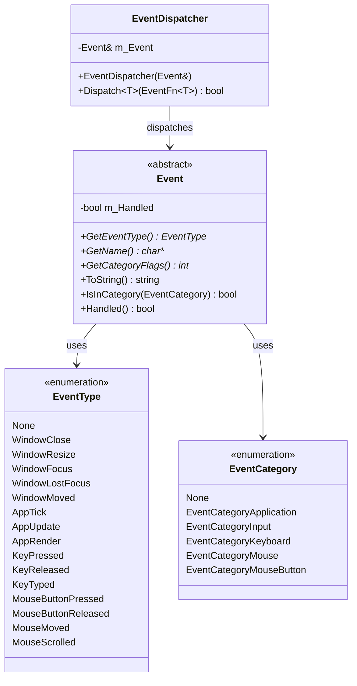
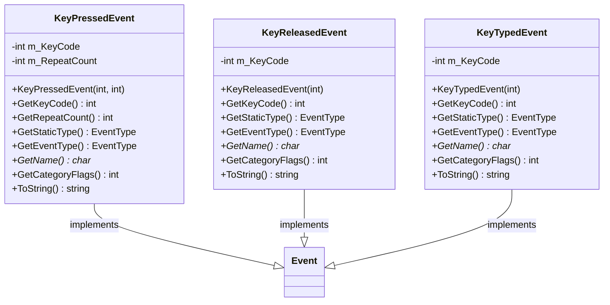
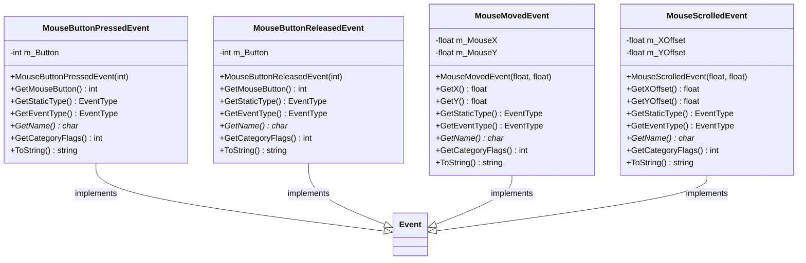
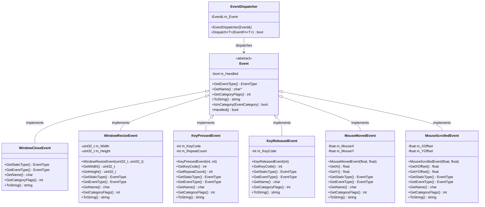

# 事件系统 UML 类图

## 事件基类和分发器类图

```mermaid
classDiagram
    class Event {
        <<abstract>>
        -bool m_Handled
        +GetEventType() EventType*
        +GetName() char**
        +GetCategoryFlags() int*
        +ToString() string
        +IsInCategory(EventCategory) bool
        +Handled() bool
    }

    class EventDispatcher {
        -Event& m_Event
        +EventDispatcher(Event&)
        +Dispatch~T~(EventFn~T~) bool
    }

    class EventType {
        <<enumeration>>
        None
        WindowClose
        WindowResize
        WindowFocus
        WindowLostFocus
        WindowMoved
        AppTick
        AppUpdate
        AppRender
        KeyPressed
        KeyReleased
        KeyTyped
        MouseButtonPressed
        MouseButtonReleased
        MouseMoved
        MouseScrolled
    }

    class EventCategory {
        <<enumeration>>
        None
        EventCategoryApplication
        EventCategoryInput
        EventCategoryKeyboard
        EventCategoryMouse
        EventCategoryMouseButton
    }

    Event --> EventType : uses
    Event --> EventCategory : uses
    EventDispatcher --> Event : dispatches
```

## 应用程序事件类图

```mermaid
classDiagram
    class WindowCloseEvent {
        +GetStaticType() EventType
        +GetEventType() EventType
        +GetName() char*
        +GetCategoryFlags() int
        +ToString() string
    }

    class WindowResizeEvent {
        -uint32_t m_Width
        -uint32_t m_Height
        +WindowResizeEvent(uint32_t, uint32_t)
        +GetWidth() uint32_t
        +GetHeight() uint32_t
        +GetStaticType() EventType
        +GetEventType() EventType
        +GetName() char*
        +GetCategoryFlags() int
        +ToString() string
    }

    class WindowFocusEvent {
        +GetStaticType() EventType
        +GetEventType() EventType
        +GetName() char*
        +GetCategoryFlags() int
        +ToString() string
    }

    class WindowLostFocusEvent {
        +GetStaticType() EventType
        +GetEventType() EventType
        +GetName() char*
        +GetCategoryFlags() int
        +ToString() string
    }

    class WindowMovedEvent {
        -uint32_t m_X
        -uint32_t m_Y
        +WindowMovedEvent(uint32_t, uint32_t)
        +GetX() uint32_t
        +GetY() uint32_t
        +GetStaticType() EventType
        +GetEventType() EventType
        +GetName() char*
        +GetCategoryFlags() int
        +ToString() string
    }

    class AppTickEvent {
        +GetStaticType() EventType
        +GetEventType() EventType
        +GetName() char*
        +GetCategoryFlags() int
        +ToString() string
    }

    class AppUpdateEvent {
        +GetStaticType() EventType
        +GetEventType() EventType
        +GetName() char*
        +GetCategoryFlags() int
        +ToString() string
    }

    class AppRenderEvent {
        +GetStaticType() EventType
        +GetEventType() EventType
        +GetName() char*
        +GetCategoryFlags() int
        +ToString() string
    }

    WindowCloseEvent --|> Event : implements
    WindowResizeEvent --|> Event : implements
    WindowFocusEvent --|> Event : implements
    WindowLostFocusEvent --|> Event : implements
    WindowMovedEvent --|> Event : implements
    AppTickEvent --|> Event : implements
    AppUpdateEvent --|> Event : implements
    AppRenderEvent --|> Event : implements
```

## 键盘事件类图

```mermaid
classDiagram
    class KeyPressedEvent {
        -int m_KeyCode
        -int m_RepeatCount
        +KeyPressedEvent(int, int)
        +GetKeyCode() int
        +GetRepeatCount() int
        +GetStaticType() EventType
        +GetEventType() EventType
        +GetName() char*
        +GetCategoryFlags() int
        +ToString() string
    }

    class KeyReleasedEvent {
        -int m_KeyCode
        +KeyReleasedEvent(int)
        +GetKeyCode() int
        +GetStaticType() EventType
        +GetEventType() EventType
        +GetName() char*
        +GetCategoryFlags() int
        +ToString() string
    }

    class KeyTypedEvent {
        -int m_KeyCode
        +KeyTypedEvent(int)
        +GetKeyCode() int
        +GetStaticType() EventType
        +GetEventType() EventType
        +GetName() char*
        +GetCategoryFlags() int
        +ToString() string
    }

    KeyPressedEvent --|> Event : implements
    KeyReleasedEvent --|> Event : implements
    KeyTypedEvent --|> Event : implements
```

## 鼠标事件类图

```mermaid
classDiagram
    class MouseButtonPressedEvent {
        -int m_Button
        +MouseButtonPressedEvent(int)
        +GetMouseButton() int
        +GetStaticType() EventType
        +GetEventType() EventType
        +GetName() char*
        +GetCategoryFlags() int
        +ToString() string
    }

    class MouseButtonReleasedEvent {
        -int m_Button
        +MouseButtonReleasedEvent(int)
        +GetMouseButton() int
        +GetStaticType() EventType
        +GetEventType() EventType
        +GetName() char*
        +GetCategoryFlags() int
        +ToString() string
    }

    class MouseMovedEvent {
        -float m_MouseX
        -float m_MouseY
        +MouseMovedEvent(float, float)
        +GetX() float
        +GetY() float
        +GetStaticType() EventType
        +GetEventType() EventType
        +GetName() char*
        +GetCategoryFlags() int
        +ToString() string
    }

    class MouseScrolledEvent {
        -float m_XOffset
        -float m_YOffset
        +MouseScrolledEvent(float, float)
        +GetXOffset() float
        +GetYOffset() float
        +GetStaticType() EventType
        +GetEventType() EventType
        +GetName() char*
        +GetCategoryFlags() int
        +ToString() string
    }

    MouseButtonPressedEvent --|> Event : implements
    MouseButtonReleasedEvent --|> Event : implements
    MouseMovedEvent --|> Event : implements
    MouseScrolledEvent --|> Event : implements
```

## 按键码定义类图

```mermaid
classDiagram
    class KeyCodes {
        <<enumeration>>
        Space
        Apostrophe
        Comma
        Minus
        Period
        Slash
        D0
        D1
        D2
        D3
        D4
        D5
        D6
        D7
        D8
        D9
        Semicolon
        Equal
        A
        B
        C
        D
        E
        F
        G
        H
        I
        J
        K
        L
        M
        N
        O
        P
        Q
        R
        S
        T
        U
        V
        W
        X
        Y
        Z
        LeftBracket
        Backslash
        RightBracket
        GraveAccent
        World1
        World2
        Escape
        Enter
        Tab
        Backspace
        Insert
        Delete
        Right
        Left
        Down
        Up
        PageUp
        PageDown
        Home
        End
        CapsLock
        ScrollLock
        NumLock
        PrintScreen
        Pause
        F1
        F2
        F3
        F4
        F5
        F6
        F7
        F8
        F9
        F10
        F11
        F12
        F13
        F14
        F15
        F16
        F17
        F18
        F19
        F20
        F21
        F22
        F23
        F24
        F25
        KP0
        KP1
        KP2
        KP3
        KP4
        KP5
        KP6
        KP7
        KP8
        KP9
        KPDecimal
        KPDivide
        KPMultiply
        KPSubtract
        KPAdd
        KPEnter
        KPEqual
        LeftShift
        LeftControl
        LeftAlt
        LeftSuper
        RightShift
        RightControl
        RightAlt
        RightSuper
        Menu
    }

    class MouseButtonCodes {
        <<enumeration>>
        Button0
        Button1
        Button2
        Button3
        Button4
        Button5
        Button6
        Button7
        ButtonLast
        ButtonLeft
        ButtonRight
        ButtonMiddle
    }
```

## 事件系统关系图

```mermaid
classDiagram
    class Event {
        <<abstract>>
        -bool m_Handled
        +GetEventType() EventType*
        +GetName() char**
        +GetCategoryFlags() int*
        +ToString() string
        +IsInCategory(EventCategory) bool
        +Handled() bool
    }

    class EventDispatcher {
        -Event& m_Event
        +EventDispatcher(Event&)
        +Dispatch~T~(EventFn~T~) bool
    }

    class WindowCloseEvent {
        +GetStaticType() EventType
        +GetEventType() EventType
        +GetName() char*
        +GetCategoryFlags() int
        +ToString() string
    }

    class WindowResizeEvent {
        -uint32_t m_Width
        -uint32_t m_Height
        +WindowResizeEvent(uint32_t, uint32_t)
        +GetWidth() uint32_t
        +GetHeight() uint32_t
        +GetStaticType() EventType
        +GetEventType() EventType
        +GetName() char*
        +GetCategoryFlags() int
        +ToString() string
    }

    class KeyPressedEvent {
        -int m_KeyCode
        -int m_RepeatCount
        +KeyPressedEvent(int, int)
        +GetKeyCode() int
        +GetRepeatCount() int
        +GetStaticType() EventType
        +GetEventType() EventType
        +GetName() char*
        +GetCategoryFlags() int
        +ToString() string
    }

    class KeyReleasedEvent {
        -int m_KeyCode
        +KeyReleasedEvent(int)
        +GetKeyCode() int
        +GetStaticType() EventType
        +GetEventType() EventType
        +GetName() char*
        +GetCategoryFlags() int
        +ToString() string
    }

    class MouseMovedEvent {
        -float m_MouseX
        -float m_MouseY
        +MouseMovedEvent(float, float)
        +GetX() float
        +GetY() float
        +GetStaticType() EventType
        +GetEventType() EventType
        +GetName() char*
        +GetCategoryFlags() int
        +ToString() string
    }

    class MouseScrolledEvent {
        -float m_XOffset
        -float m_YOffset
        +MouseScrolledEvent(float, float)
        +GetXOffset() float
        +GetYOffset() float
        +GetStaticType() EventType
        +GetEventType() EventType
        +GetName() char*
        +GetCategoryFlags() int
        +ToString() string
    }

    Event <|-- WindowCloseEvent : implements
    Event <|-- WindowResizeEvent : implements
    Event <|-- KeyPressedEvent : implements
    Event <|-- KeyReleasedEvent : implements
    Event <|-- MouseMovedEvent : implements
    Event <|-- MouseScrolledEvent : implements
    EventDispatcher --> Event : dispatches
```
