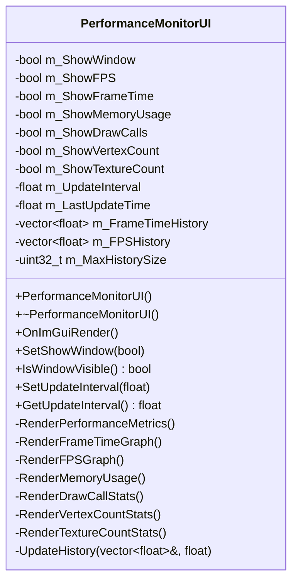
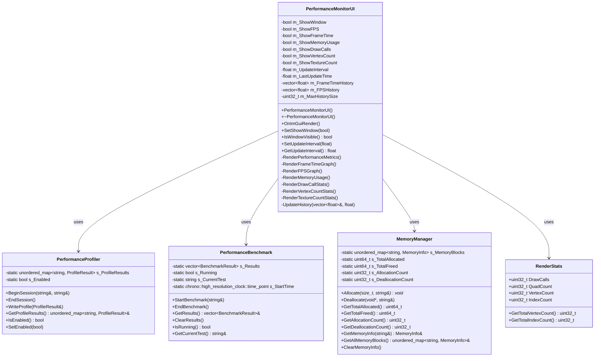
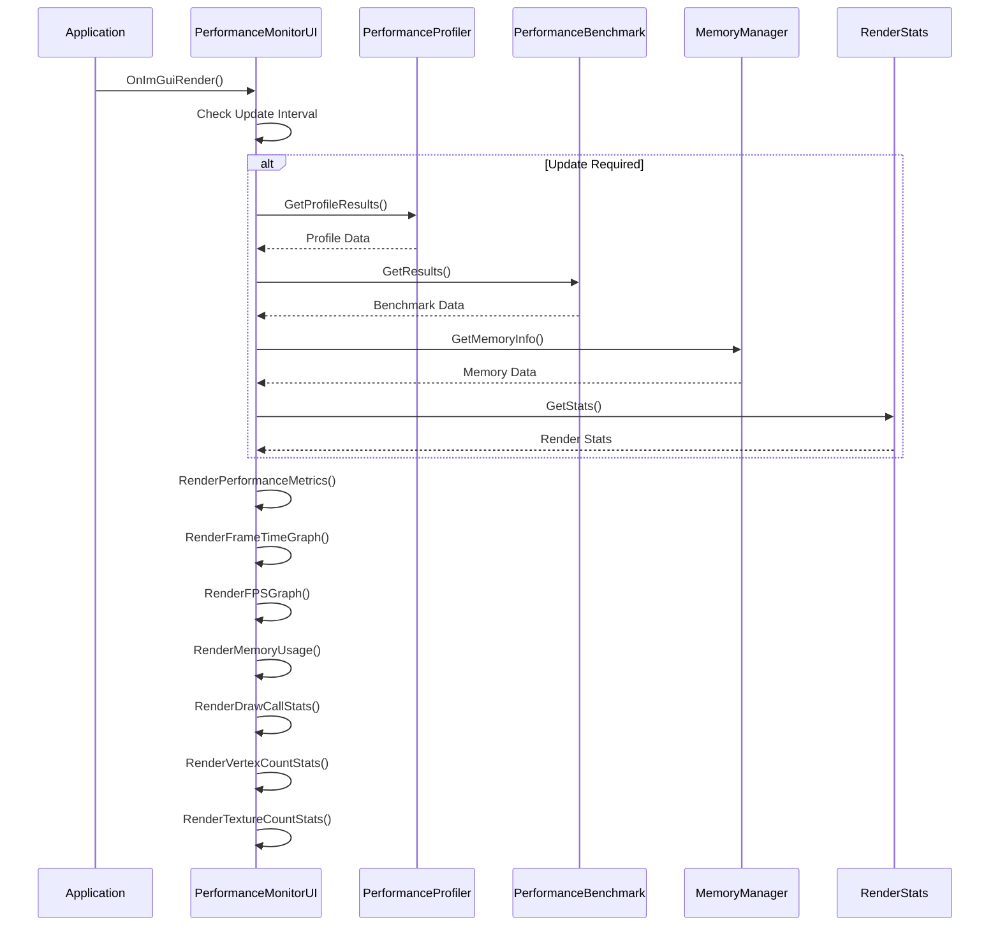

# PerformanceMonitorUI 类 UML 图

## PerformanceMonitorUI 类详细结构

## PerformanceMonitorUI 类关系图

## PerformanceMonitorUI 渲染流程图

## PerformanceMonitorUI 类说明

### 职责
- **性能监控**: 实时监控引擎性能指标
- **数据可视化**: 通过图表和数值显示性能数据
- **历史记录**: 维护性能数据的历史记录
- **用户界面**: 提供直观的性能监控界面

### 设计模式
- **观察者模式**: 观察性能数据变化
- **策略模式**: 支持不同的显示策略
- **单例模式**: 全局唯一的性能监控UI

### 监控指标
- **帧率**: FPS和帧时间
- **内存使用**: 内存分配和释放统计
- **渲染统计**: 绘制调用、顶点数量、纹理数量
- **性能分析**: 函数执行时间分析
- **基准测试**: 性能基准测试结果

### 可视化组件
- **实时图表**: 帧时间和FPS的实时图表
- **数值显示**: 关键性能指标的数值显示
- **历史图表**: 性能数据的历史趋势
- **内存图表**: 内存使用情况的可视化
- **渲染统计**: 渲染相关的统计信息

### 关键特性
- **实时更新**: 实时更新性能数据
- **历史记录**: 维护性能数据历史
- **可配置**: 支持显示选项的配置
- **高效渲染**: 优化的UI渲染性能
- **用户友好**: 直观的界面设计

### 使用场景
- **开发调试**: 开发过程中的性能调试
- **性能优化**: 性能瓶颈的识别和优化
- **基准测试**: 性能基准测试和比较
- **监控告警**: 性能异常的监控和告警
- **用户分析**: 用户体验的性能分析
