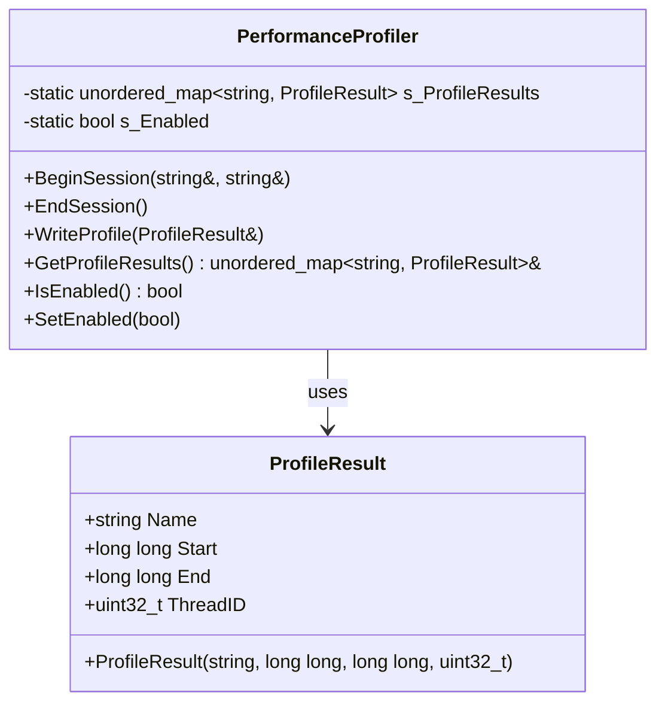
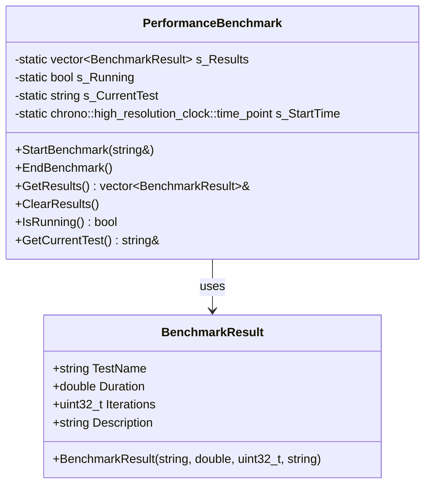
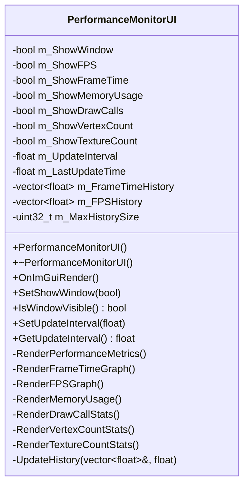
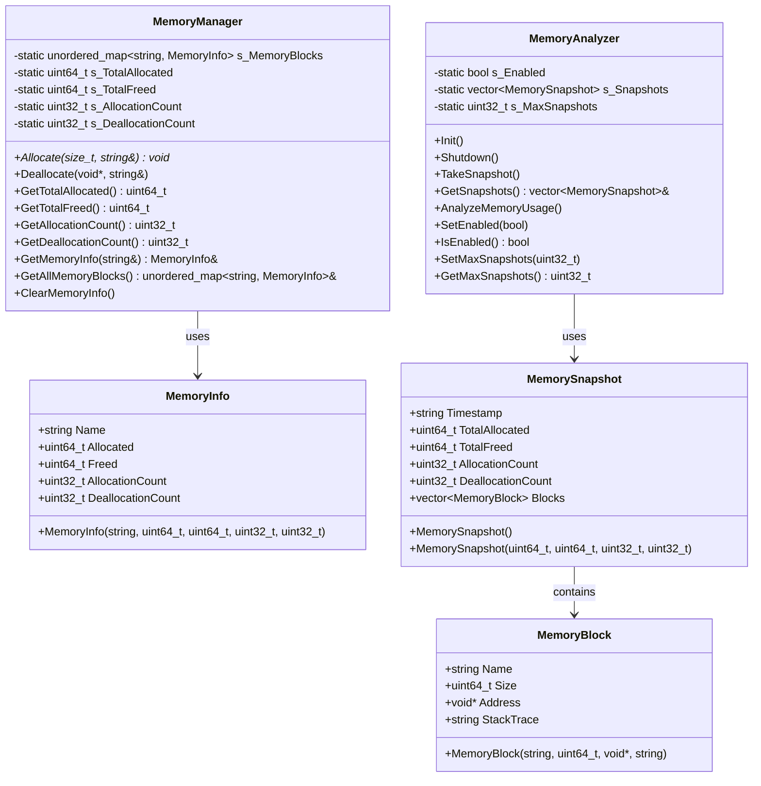
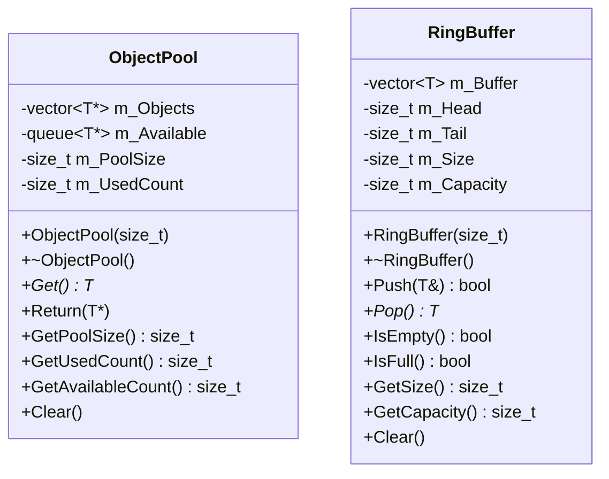
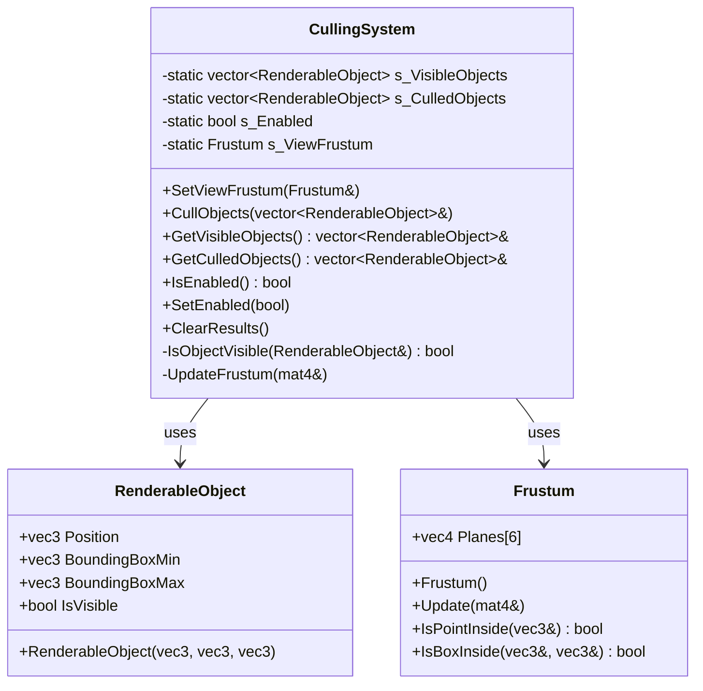
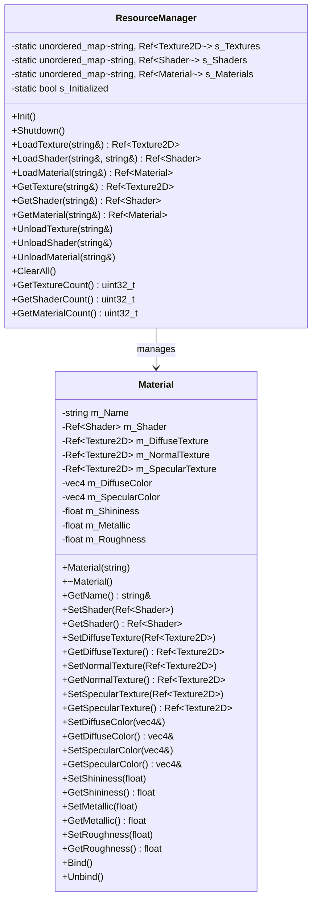
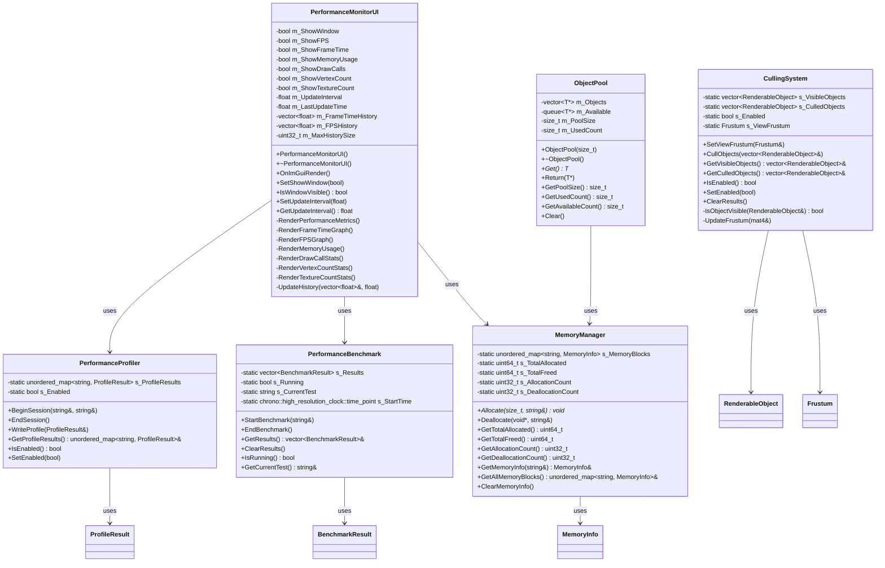

# 性能监控系统 UML 类图

## 性能分析器类图

```mermaid
classDiagram
    class PerformanceProfiler {
        -static unordered_map~string, ProfileResult~ s_ProfileResults
        -static bool s_Enabled
        +BeginSession(string&, string&)
        +EndSession()
        +WriteProfile(ProfileResult&)
        +GetProfileResults() unordered_map~string, ProfileResult~&
        +IsEnabled() bool
        +SetEnabled(bool)
    }

    class ProfileResult {
        +string Name
        +long long Start
        +long long End
        +uint32_t ThreadID
        +ProfileResult(string, long long, long long, uint32_t)
    }

    PerformanceProfiler --> ProfileResult : uses
```

## 性能基准测试类图

```mermaid
classDiagram
    class PerformanceBenchmark {
        -static vector~BenchmarkResult~ s_Results
        -static bool s_Running
        -static string s_CurrentTest
        -static chrono::high_resolution_clock::time_point s_StartTime
        +StartBenchmark(string&)
        +EndBenchmark()
        +GetResults() vector~BenchmarkResult~&
        +ClearResults()
        +IsRunning() bool
        +GetCurrentTest() string&
    }

    class BenchmarkResult {
        +string TestName
        +double Duration
        +uint32_t Iterations
        +string Description
        +BenchmarkResult(string, double, uint32_t, string)
    }

    PerformanceBenchmark --> BenchmarkResult : uses
```

## 性能监控UI类图

```mermaid
classDiagram
    class PerformanceMonitorUI {
        -bool m_ShowWindow
        -bool m_ShowFPS
        -bool m_ShowFrameTime
        -bool m_ShowMemoryUsage
        -bool m_ShowDrawCalls
        -bool m_ShowVertexCount
        -bool m_ShowTextureCount
        -float m_UpdateInterval
        -float m_LastUpdateTime
        -vector~float~ m_FrameTimeHistory
        -vector~float~ m_FPSHistory
        -uint32_t m_MaxHistorySize
        +PerformanceMonitorUI()
        +~PerformanceMonitorUI()
        +OnImGuiRender()
        +SetShowWindow(bool)
        +IsWindowVisible() bool
        +SetUpdateInterval(float)
        +GetUpdateInterval() float
        -RenderPerformanceMetrics()
        -RenderFrameTimeGraph()
        -RenderFPSGraph()
        -RenderMemoryUsage()
        -RenderDrawCallStats()
        -RenderVertexCountStats()
        -RenderTextureCountStats()
        -UpdateHistory(vector~float~&, float)
    }
```

## 内存管理类图

```mermaid
classDiagram
    class MemoryManager {
        -static unordered_map~string, MemoryInfo~ s_MemoryBlocks
        -static uint64_t s_TotalAllocated
        -static uint64_t s_TotalFreed
        -static uint32_t s_AllocationCount
        -static uint32_t s_DeallocationCount
        +Allocate(size_t, string&) void*
        +Deallocate(void*, string&)
        +GetTotalAllocated() uint64_t
        +GetTotalFreed() uint64_t
        +GetAllocationCount() uint32_t
        +GetDeallocationCount() uint32_t
        +GetMemoryInfo(string&) MemoryInfo&
        +GetAllMemoryBlocks() unordered_map~string, MemoryInfo~&
        +ClearMemoryInfo()
    }

    class MemoryInfo {
        +string Name
        +uint64_t Allocated
        +uint64_t Freed
        +uint32_t AllocationCount
        +uint32_t DeallocationCount
        +MemoryInfo(string, uint64_t, uint64_t, uint32_t, uint32_t)
    }

    class MemoryAnalyzer {
        -static bool s_Enabled
        -static vector~MemorySnapshot~ s_Snapshots
        -static uint32_t s_MaxSnapshots
        +Init()
        +Shutdown()
        +TakeSnapshot()
        +GetSnapshots() vector~MemorySnapshot~&
        +AnalyzeMemoryUsage()
        +SetEnabled(bool)
        +IsEnabled() bool
        +SetMaxSnapshots(uint32_t)
        +GetMaxSnapshots() uint32_t
    }

    class MemorySnapshot {
        +string Timestamp
        +uint64_t TotalAllocated
        +uint64_t TotalFreed
        +uint32_t AllocationCount
        +uint32_t DeallocationCount
        +vector~MemoryBlock~ Blocks
        +MemorySnapshot()
        +MemorySnapshot(uint64_t, uint64_t, uint32_t, uint32_t)
    }

    class MemoryBlock {
        +string Name
        +uint64_t Size
        +void* Address
        +string StackTrace
        +MemoryBlock(string, uint64_t, void*, string)
    }

    MemoryManager --> MemoryInfo : uses
    MemoryAnalyzer --> MemorySnapshot : uses
    MemorySnapshot --> MemoryBlock : contains
```

## 对象池类图

```mermaid
classDiagram
    class ObjectPool {
        -vector~T*~ m_Objects
        -queue~T*~ m_Available
        -size_t m_PoolSize
        -size_t m_UsedCount
        +ObjectPool(size_t)
        +~ObjectPool()
        +Get() T*
        +Return(T*)
        +GetPoolSize() size_t
        +GetUsedCount() size_t
        +GetAvailableCount() size_t
        +Clear()
    }

    class RingBuffer {
        -vector~T~ m_Buffer
        -size_t m_Head
        -size_t m_Tail
        -size_t m_Size
        -size_t m_Capacity
        +RingBuffer(size_t)
        +~RingBuffer()
        +Push(T&) bool
        +Pop() T*
        +IsEmpty() bool
        +IsFull() bool
        +GetSize() size_t
        +GetCapacity() size_t
        +Clear()
    }
```

## 剔除系统类图

```mermaid
classDiagram
    class CullingSystem {
        -static vector~RenderableObject~ s_VisibleObjects
        -static vector~RenderableObject~ s_CulledObjects
        -static bool s_Enabled
        -static Frustum s_ViewFrustum
        +SetViewFrustum(Frustum&)
        +CullObjects(vector~RenderableObject~&)
        +GetVisibleObjects() vector~RenderableObject~&
        +GetCulledObjects() vector~RenderableObject~&
        +IsEnabled() bool
        +SetEnabled(bool)
        +ClearResults()
        -IsObjectVisible(RenderableObject&) bool
        -UpdateFrustum(mat4&)
    }

    class RenderableObject {
        +vec3 Position
        +vec3 BoundingBoxMin
        +vec3 BoundingBoxMax
        +bool IsVisible
        +RenderableObject(vec3, vec3, vec3)
    }

    class Frustum {
        +vec4 Planes[6]
        +Frustum()
        +Update(mat4&)
        +IsPointInside(vec3&) bool
        +IsBoxInside(vec3&, vec3&) bool
    }

    CullingSystem --> RenderableObject : uses
    CullingSystem --> Frustum : uses
```

## 资源管理器类图

```mermaid
classDiagram
    class ResourceManager {
        -static unordered_map~string, Ref~Texture2D~~ s_Textures
        -static unordered_map~string, Ref~Shader~~ s_Shaders
        -static unordered_map~string, Ref~Material~~ s_Materials
        -static bool s_Initialized
        +Init()
        +Shutdown()
        +LoadTexture(string&) Ref~Texture2D~
        +LoadShader(string&, string&) Ref~Shader~
        +LoadMaterial(string&) Ref~Material~
        +GetTexture(string&) Ref~Texture2D~
        +GetShader(string&) Ref~Shader~
        +GetMaterial(string&) Ref~Material~
        +UnloadTexture(string&)
        +UnloadShader(string&)
        +UnloadMaterial(string&)
        +ClearAll()
        +GetTextureCount() uint32_t
        +GetShaderCount() uint32_t
        +GetMaterialCount() uint32_t
    }

    class Material {
        -string m_Name
        -Ref~Shader~ m_Shader
        -Ref~Texture2D~ m_DiffuseTexture
        -Ref~Texture2D~ m_NormalTexture
        -Ref~Texture2D~ m_SpecularTexture
        -vec4 m_DiffuseColor
        -vec4 m_SpecularColor
        -float m_Shininess
        -float m_Metallic
        -float m_Roughness
        +Material(string)
        +~Material()
        +GetName() string&
        +SetShader(Ref~Shader~)
        +GetShader() Ref~Shader~
        +SetDiffuseTexture(Ref~Texture2D~)
        +GetDiffuseTexture() Ref~Texture2D~
        +SetNormalTexture(Ref~Texture2D~)
        +GetNormalTexture() Ref~Texture2D~
        +SetSpecularTexture(Ref~Texture2D~)
        +GetSpecularTexture() Ref~Texture2D~
        +SetDiffuseColor(vec4&)
        +GetDiffuseColor() vec4&
        +SetSpecularColor(vec4&)
        +GetSpecularColor() vec4&
        +SetShininess(float)
        +GetShininess() float
        +SetMetallic(float)
        +GetMetallic() float
        +SetRoughness(float)
        +GetRoughness() float
        +Bind()
        +Unbind()
    }

    ResourceManager --> Material : manages
```

## 性能监控系统关系图

```mermaid
classDiagram
    class PerformanceProfiler {
        -static unordered_map~string, ProfileResult~ s_ProfileResults
        -static bool s_Enabled
        +BeginSession(string&, string&)
        +EndSession()
        +WriteProfile(ProfileResult&)
        +GetProfileResults() unordered_map~string, ProfileResult~&
        +IsEnabled() bool
        +SetEnabled(bool)
    }

    class PerformanceBenchmark {
        -static vector~BenchmarkResult~ s_Results
        -static bool s_Running
        -static string s_CurrentTest
        -static chrono::high_resolution_clock::time_point s_StartTime
        +StartBenchmark(string&)
        +EndBenchmark()
        +GetResults() vector~BenchmarkResult~&
        +ClearResults()
        +IsRunning() bool
        +GetCurrentTest() string&
    }

    class PerformanceMonitorUI {
        -bool m_ShowWindow
        -bool m_ShowFPS
        -bool m_ShowFrameTime
        -bool m_ShowMemoryUsage
        -bool m_ShowDrawCalls
        -bool m_ShowVertexCount
        -bool m_ShowTextureCount
        -float m_UpdateInterval
        -float m_LastUpdateTime
        -vector~float~ m_FrameTimeHistory
        -vector~float~ m_FPSHistory
        -uint32_t m_MaxHistorySize
        +PerformanceMonitorUI()
        +~PerformanceMonitorUI()
        +OnImGuiRender()
        +SetShowWindow(bool)
        +IsWindowVisible() bool
        +SetUpdateInterval(float)
        +GetUpdateInterval() float
        -RenderPerformanceMetrics()
        -RenderFrameTimeGraph()
        -RenderFPSGraph()
        -RenderMemoryUsage()
        -RenderDrawCallStats()
        -RenderVertexCountStats()
        -RenderTextureCountStats()
        -UpdateHistory(vector~float~&, float)
    }

    class MemoryManager {
        -static unordered_map~string, MemoryInfo~ s_MemoryBlocks
        -static uint64_t s_TotalAllocated
        -static uint64_t s_TotalFreed
        -static uint32_t s_AllocationCount
        -static uint32_t s_DeallocationCount
        +Allocate(size_t, string&) void*
        +Deallocate(void*, string&)
        +GetTotalAllocated() uint64_t
        +GetTotalFreed() uint64_t
        +GetAllocationCount() uint32_t
        +GetDeallocationCount() uint32_t
        +GetMemoryInfo(string&) MemoryInfo&
        +GetAllMemoryBlocks() unordered_map~string, MemoryInfo~&
        +ClearMemoryInfo()
    }

    class ObjectPool {
        -vector~T*~ m_Objects
        -queue~T*~ m_Available
        -size_t m_PoolSize
        -size_t m_UsedCount
        +ObjectPool(size_t)
        +~ObjectPool()
        +Get() T*
        +Return(T*)
        +GetPoolSize() size_t
        +GetUsedCount() size_t
        +GetAvailableCount() size_t
        +Clear()
    }

    class CullingSystem {
        -static vector~RenderableObject~ s_VisibleObjects
        -static vector~RenderableObject~ s_CulledObjects
        -static bool s_Enabled
        -static Frustum s_ViewFrustum
        +SetViewFrustum(Frustum&)
        +CullObjects(vector~RenderableObject~&)
        +GetVisibleObjects() vector~RenderableObject~&
        +GetCulledObjects() vector~RenderableObject~&
        +IsEnabled() bool
        +SetEnabled(bool)
        +ClearResults()
        -IsObjectVisible(RenderableObject&) bool
        -UpdateFrustum(mat4&)
    }

    PerformanceProfiler --> ProfileResult : uses
    PerformanceBenchmark --> BenchmarkResult : uses
    PerformanceMonitorUI --> PerformanceProfiler : uses
    PerformanceMonitorUI --> PerformanceBenchmark : uses
    PerformanceMonitorUI --> MemoryManager : uses
    MemoryManager --> MemoryInfo : uses
    ObjectPool --> MemoryManager : uses
    CullingSystem --> RenderableObject : uses
    CullingSystem --> Frustum : uses
```
