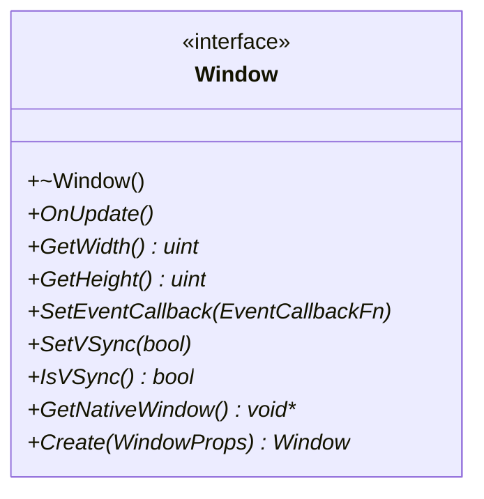
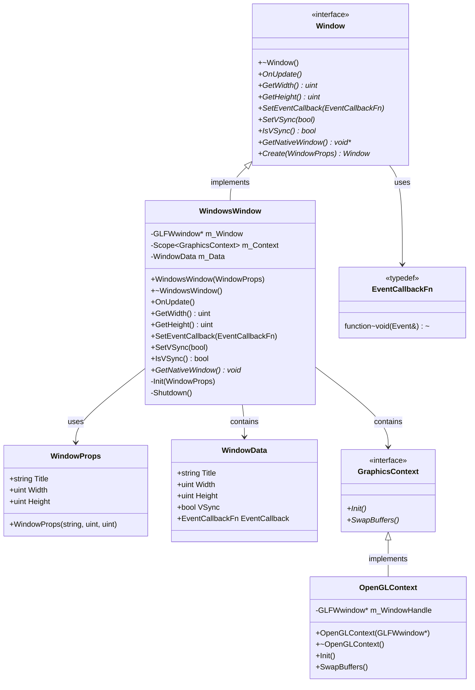
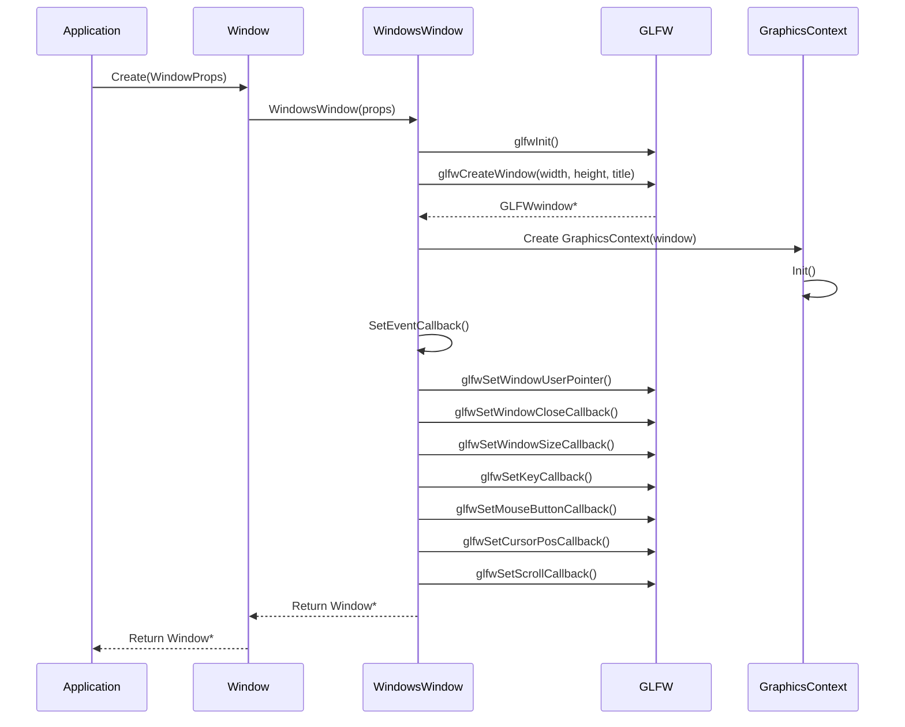
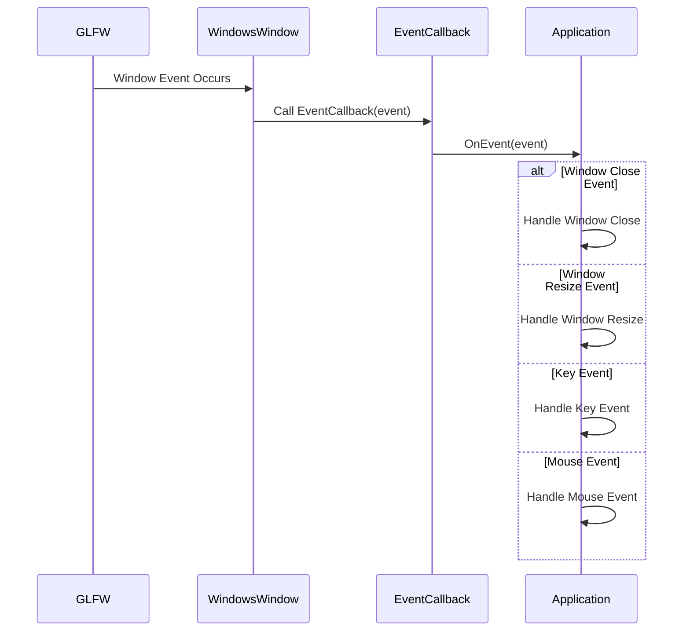

# Window 类 UML 图

## Window 类详细结构

## Window 类关系图

## Window 创建流程图

## Window 事件处理流程图

## Window 类说明

### 职责
- **窗口管理**: 管理窗口的创建、更新和销毁
- **事件处理**: 处理窗口相关的事件
- **图形上下文**: 管理图形渲染上下文
- **平台抽象**: 提供跨平台的窗口接口

### 设计模式
- **抽象工厂模式**: 通过Create()工厂方法创建窗口
- **观察者模式**: 通过事件回调处理窗口事件
- **适配器模式**: 适配不同平台的窗口实现

### 核心功能
- **窗口创建**: 创建和管理窗口实例
- **事件处理**: 处理窗口、键盘、鼠标事件
- **尺寸管理**: 管理窗口尺寸和位置
- **VSync控制**: 控制垂直同步
- **上下文管理**: 管理图形渲染上下文

### 平台支持
- **Windows**: 通过GLFW实现Windows窗口
- **Linux**: 通过GLFW实现Linux窗口
- **macOS**: 通过GLFW实现macOS窗口

### 关键特性
- **跨平台**: 统一的跨平台窗口接口
- **事件驱动**: 完整的事件处理机制
- **资源管理**: 自动管理窗口资源
- **性能优化**: 高效的窗口更新机制
- **可扩展性**: 易于扩展新的平台支持

### 事件类型
- **窗口事件**: 关闭、调整大小、移动、焦点
- **键盘事件**: 按键、释放、输入
- **鼠标事件**: 移动、按键、滚轮
- **应用事件**: 更新、渲染、定时器
