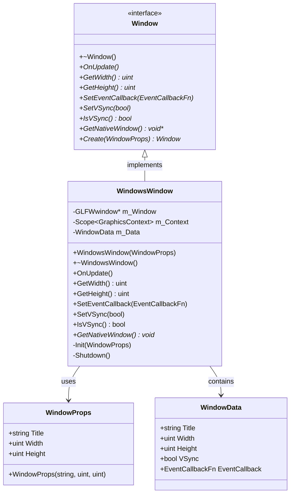
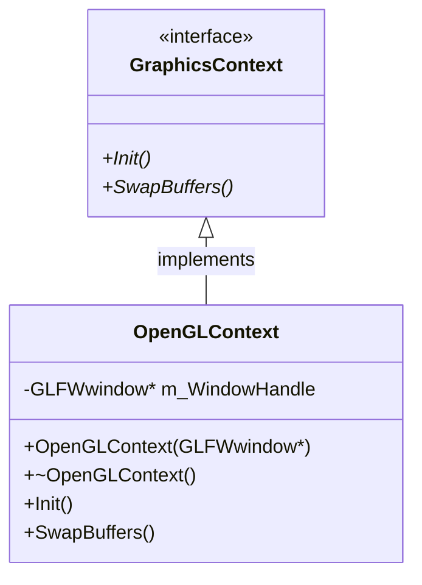
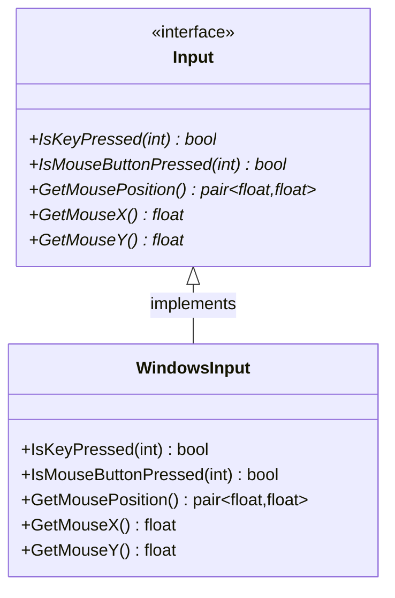
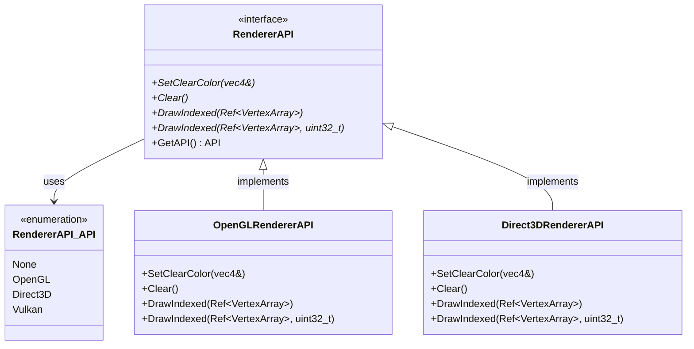
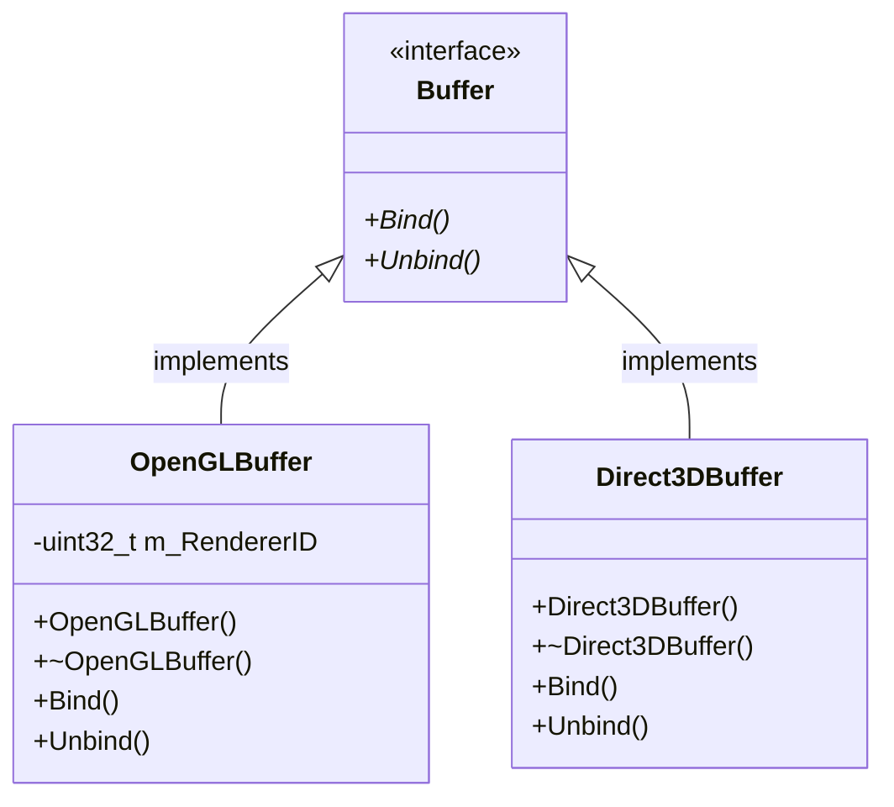
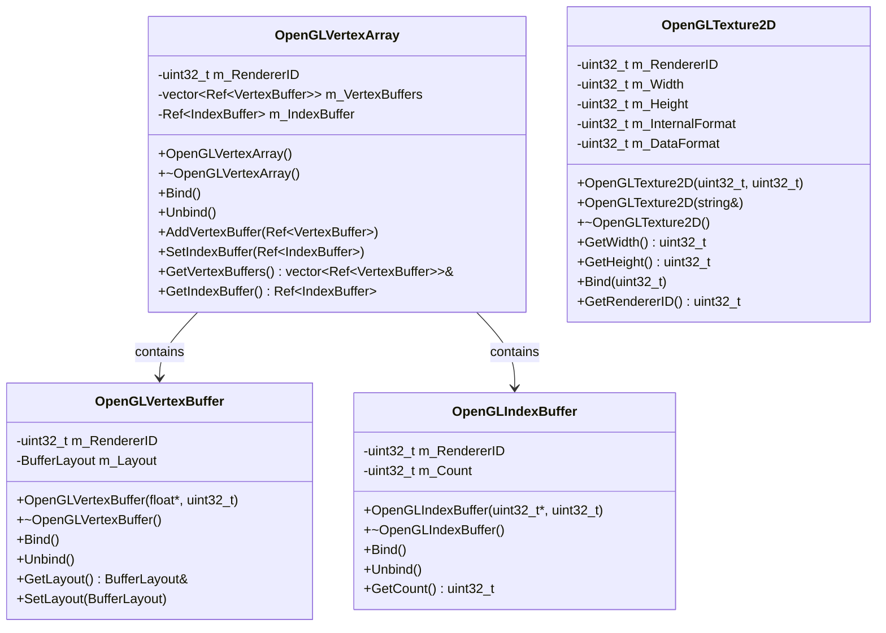
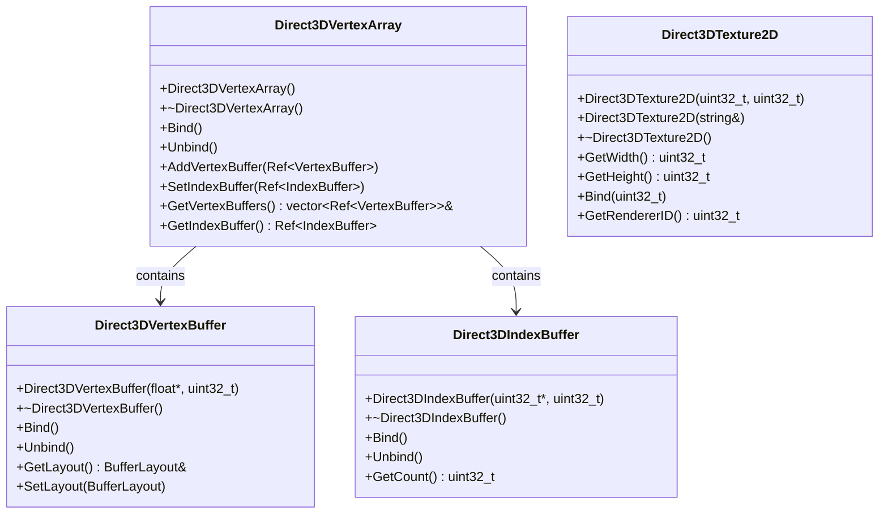
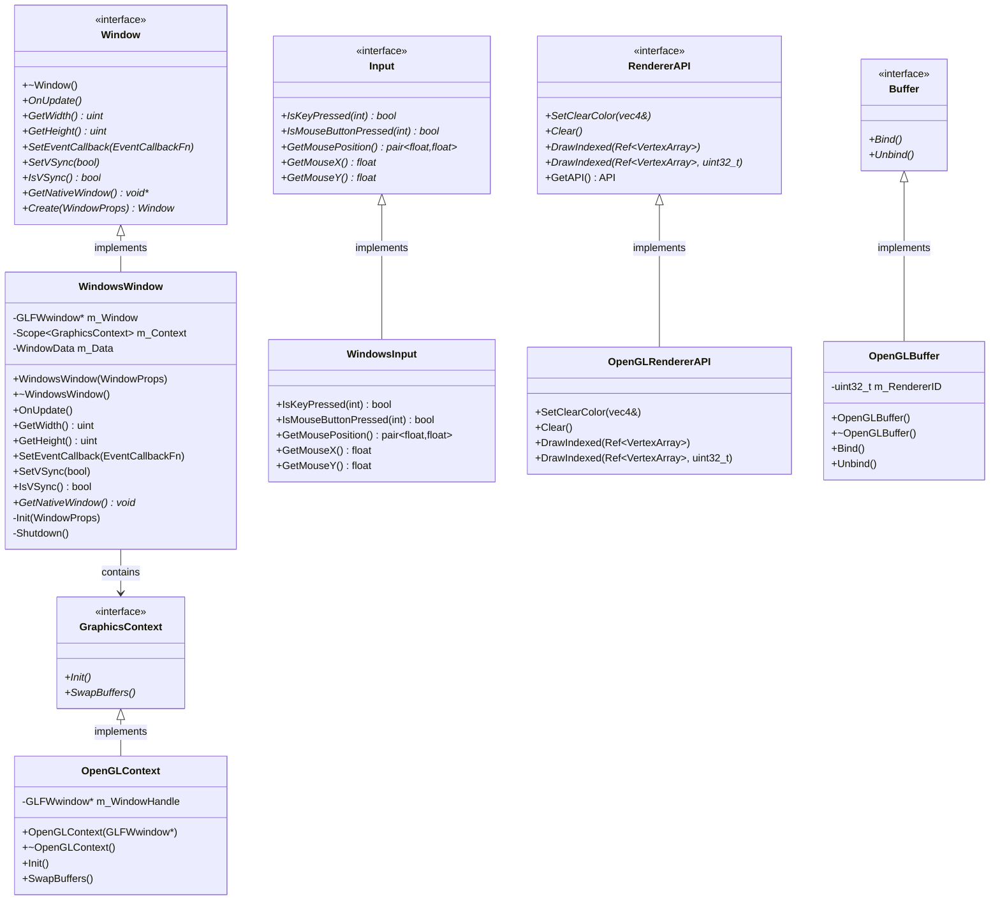

# 平台抽象层 UML 类图

## 窗口系统类图

```mermaid
classDiagram
    class Window {
        <<interface>>
        +~Window()
        +OnUpdate()*
        +GetWidth() uint*
        +GetHeight() uint*
        +SetEventCallback(EventCallbackFn)*
        +SetVSync(bool)*
        +IsVSync() bool*
        +GetNativeWindow() void**
        +Create(WindowProps) Window*
    }

    class WindowsWindow {
        -GLFWwindow* m_Window
        -Scope~GraphicsContext~ m_Context
        -WindowData m_Data
        +WindowsWindow(WindowProps)
        +~WindowsWindow()
        +OnUpdate()
        +GetWidth() uint
        +GetHeight() uint
        +SetEventCallback(EventCallbackFn)
        +SetVSync(bool)
        +IsVSync() bool
        +GetNativeWindow() void*
        -Init(WindowProps)
        -Shutdown()
    }

    class WindowProps {
        +string Title
        +uint Width
        +uint Height
        +WindowProps(string, uint, uint)
    }

    class WindowData {
        +string Title
        +uint Width
        +uint Height
        +bool VSync
        +EventCallbackFn EventCallback
    }

    Window <|-- WindowsWindow : implements
    WindowsWindow --> WindowProps : uses
    WindowsWindow --> WindowData : contains
```

## 图形上下文类图

```mermaid
classDiagram
    class GraphicsContext {
        <<interface>>
        +Init()*
        +SwapBuffers()*
    }

    class OpenGLContext {
        -GLFWwindow* m_WindowHandle
        +OpenGLContext(GLFWwindow*)
        +~OpenGLContext()
        +Init()
        +SwapBuffers()
    }

    GraphicsContext <|-- OpenGLContext : implements
```

## 输入系统类图

```mermaid
classDiagram
    class Input {
        <<interface>>
        +IsKeyPressed(int) bool*
        +IsMouseButtonPressed(int) bool*
        +GetMousePosition() pair~float,float~*
        +GetMouseX() float*
        +GetMouseY() float*
    }

    class WindowsInput {
        +IsKeyPressed(int) bool
        +IsMouseButtonPressed(int) bool
        +GetMousePosition() pair~float,float~
        +GetMouseX() float
        +GetMouseY() float
    }

    Input <|-- WindowsInput : implements
```

## 渲染API抽象类图

```mermaid
classDiagram
    class RendererAPI {
        <<interface>>
        +SetClearColor(vec4&)*
        +Clear()*
        +DrawIndexed(Ref~VertexArray~)*
        +DrawIndexed(Ref~VertexArray~, uint32_t)*
        +GetAPI() API
    }

    class OpenGLRendererAPI {
        +SetClearColor(vec4&)
        +Clear()
        +DrawIndexed(Ref~VertexArray~)
        +DrawIndexed(Ref~VertexArray~, uint32_t)
    }

    class Direct3DRendererAPI {
        +SetClearColor(vec4&)
        +Clear()
        +DrawIndexed(Ref~VertexArray~)
        +DrawIndexed(Ref~VertexArray~, uint32_t)
    }

    class RendererAPI_API {
        <<enumeration>>
        None
        OpenGL
        Direct3D
        Vulkan
    }

    RendererAPI --> RendererAPI_API : uses
    RendererAPI <|-- OpenGLRendererAPI : implements
    RendererAPI <|-- Direct3DRendererAPI : implements
```

## 缓冲区抽象类图

```mermaid
classDiagram
    class Buffer {
        <<interface>>
        +Bind()*
        +Unbind()*
    }

    class OpenGLBuffer {
        -uint32_t m_RendererID
        +OpenGLBuffer()
        +~OpenGLBuffer()
        +Bind()
        +Unbind()
    }

    class Direct3DBuffer {
        +Direct3DBuffer()
        +~Direct3DBuffer()
        +Bind()
        +Unbind()
    }

    Buffer <|-- OpenGLBuffer : implements
    Buffer <|-- Direct3DBuffer : implements
```

## OpenGL 平台实现类图

```mermaid
classDiagram
    class OpenGLVertexArray {
        -uint32_t m_RendererID
        -vector~Ref~VertexBuffer~~ m_VertexBuffers
        -Ref~IndexBuffer~ m_IndexBuffer
        +OpenGLVertexArray()
        +~OpenGLVertexArray()
        +Bind()
        +Unbind()
        +AddVertexBuffer(Ref~VertexBuffer~)
        +SetIndexBuffer(Ref~IndexBuffer~)
        +GetVertexBuffers() vector~Ref~VertexBuffer~~&
        +GetIndexBuffer() Ref~IndexBuffer~
    }

    class OpenGLVertexBuffer {
        -uint32_t m_RendererID
        -BufferLayout m_Layout
        +OpenGLVertexBuffer(float*, uint32_t)
        +~OpenGLVertexBuffer()
        +Bind()
        +Unbind()
        +GetLayout() BufferLayout&
        +SetLayout(BufferLayout)
    }

    class OpenGLIndexBuffer {
        -uint32_t m_RendererID
        -uint32_t m_Count
        +OpenGLIndexBuffer(uint32_t*, uint32_t)
        +~OpenGLIndexBuffer()
        +Bind()
        +Unbind()
        +GetCount() uint32_t
    }

    class OpenGLTexture2D {
        -uint32_t m_RendererID
        -uint32_t m_Width
        -uint32_t m_Height
        -uint32_t m_InternalFormat
        -uint32_t m_DataFormat
        +OpenGLTexture2D(uint32_t, uint32_t)
        +OpenGLTexture2D(string&)
        +~OpenGLTexture2D()
        +GetWidth() uint32_t
        +GetHeight() uint32_t
        +Bind(uint32_t)
        +GetRendererID() uint32_t
    }

    OpenGLVertexArray --> OpenGLVertexBuffer : contains
    OpenGLVertexArray --> OpenGLIndexBuffer : contains
```

## Direct3D 平台实现类图 (预留)

```mermaid
classDiagram
    class Direct3DVertexArray {
        +Direct3DVertexArray()
        +~Direct3DVertexArray()
        +Bind()
        +Unbind()
        +AddVertexBuffer(Ref~VertexBuffer~)
        +SetIndexBuffer(Ref~IndexBuffer~)
        +GetVertexBuffers() vector~Ref~VertexBuffer~~&
        +GetIndexBuffer() Ref~IndexBuffer~
    }

    class Direct3DVertexBuffer {
        +Direct3DVertexBuffer(float*, uint32_t)
        +~Direct3DVertexBuffer()
        +Bind()
        +Unbind()
        +GetLayout() BufferLayout&
        +SetLayout(BufferLayout)
    }

    class Direct3DIndexBuffer {
        +Direct3DIndexBuffer(uint32_t*, uint32_t)
        +~Direct3DIndexBuffer()
        +Bind()
        +Unbind()
        +GetCount() uint32_t
    }

    class Direct3DTexture2D {
        +Direct3DTexture2D(uint32_t, uint32_t)
        +Direct3DTexture2D(string&)
        +~Direct3DTexture2D()
        +GetWidth() uint32_t
        +GetHeight() uint32_t
        +Bind(uint32_t)
        +GetRendererID() uint32_t
    }

    Direct3DVertexArray --> Direct3DVertexBuffer : contains
    Direct3DVertexArray --> Direct3DIndexBuffer : contains
```

## 平台抽象层关系图

```mermaid
classDiagram
    class Window {
        <<interface>>
        +~Window()
        +OnUpdate()*
        +GetWidth() uint*
        +GetHeight() uint*
        +SetEventCallback(EventCallbackFn)*
        +SetVSync(bool)*
        +IsVSync() bool*
        +GetNativeWindow() void**
        +Create(WindowProps) Window*
    }

    class WindowsWindow {
        -GLFWwindow* m_Window
        -Scope~GraphicsContext~ m_Context
        -WindowData m_Data
        +WindowsWindow(WindowProps)
        +~WindowsWindow()
        +OnUpdate()
        +GetWidth() uint
        +GetHeight() uint
        +SetEventCallback(EventCallbackFn)
        +SetVSync(bool)
        +IsVSync() bool
        +GetNativeWindow() void*
        -Init(WindowProps)
        -Shutdown()
    }

    class GraphicsContext {
        <<interface>>
        +Init()*
        +SwapBuffers()*
    }

    class OpenGLContext {
        -GLFWwindow* m_WindowHandle
        +OpenGLContext(GLFWwindow*)
        +~OpenGLContext()
        +Init()
        +SwapBuffers()
    }

    class Input {
        <<interface>>
        +IsKeyPressed(int) bool*
        +IsMouseButtonPressed(int) bool*
        +GetMousePosition() pair~float,float~*
        +GetMouseX() float*
        +GetMouseY() float*
    }

    class WindowsInput {
        +IsKeyPressed(int) bool
        +IsMouseButtonPressed(int) bool
        +GetMousePosition() pair~float,float~
        +GetMouseX() float
        +GetMouseY() float
    }

    class RendererAPI {
        <<interface>>
        +SetClearColor(vec4&)*
        +Clear()*
        +DrawIndexed(Ref~VertexArray~)*
        +DrawIndexed(Ref~VertexArray~, uint32_t)*
        +GetAPI() API
    }

    class OpenGLRendererAPI {
        +SetClearColor(vec4&)
        +Clear()
        +DrawIndexed(Ref~VertexArray~)
        +DrawIndexed(Ref~VertexArray~, uint32_t)
    }

    class Buffer {
        <<interface>>
        +Bind()*
        +Unbind()*
    }

    class OpenGLBuffer {
        -uint32_t m_RendererID
        +OpenGLBuffer()
        +~OpenGLBuffer()
        +Bind()
        +Unbind()
    }

    Window <|-- WindowsWindow : implements
    WindowsWindow --> GraphicsContext : contains
    GraphicsContext <|-- OpenGLContext : implements
    Input <|-- WindowsInput : implements
    RendererAPI <|-- OpenGLRendererAPI : implements
    Buffer <|-- OpenGLBuffer : implements
```
