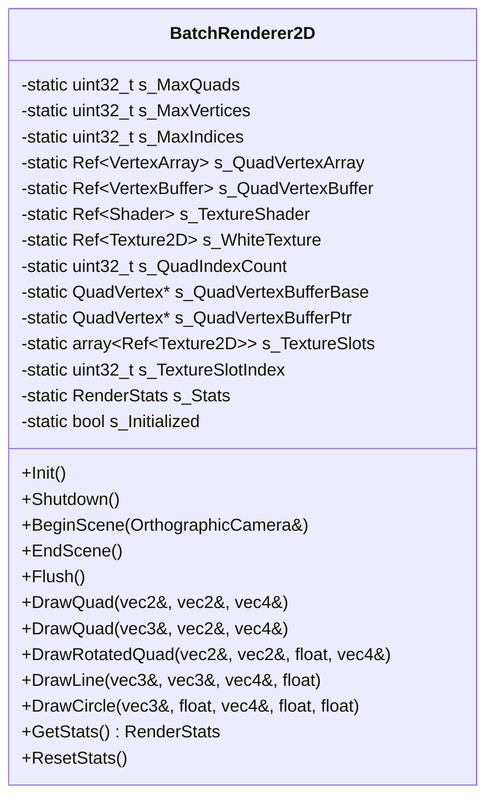
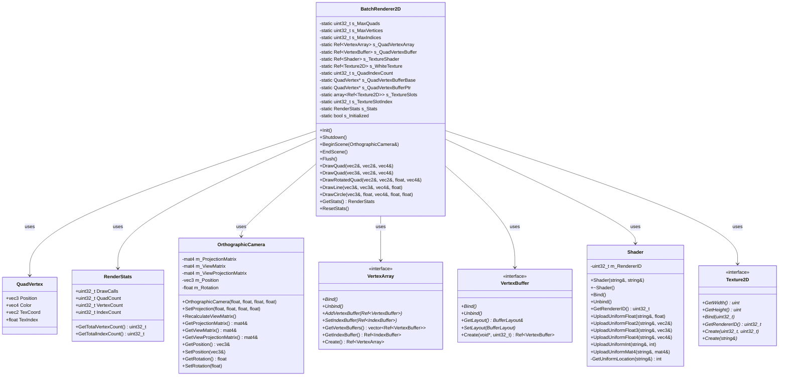
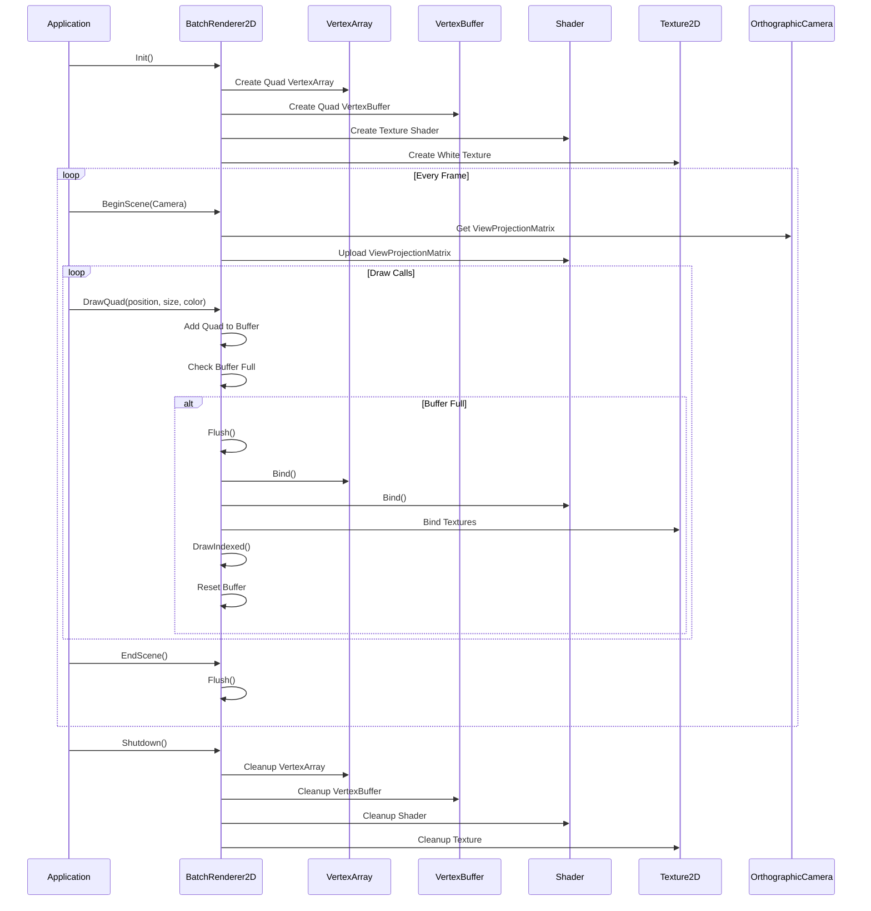

# BatchRenderer2D 类 UML 图

## BatchRenderer2D 类详细结构

## BatchRenderer2D 类关系图

## BatchRenderer2D 渲染流程图

## BatchRenderer2D 类说明

### 职责
- **2D渲染**: 高效的2D图元批处理渲染
- **图元支持**: 支持四边形、线条、圆形等2D图元
- **纹理批处理**: 支持多纹理的批处理渲染
- **性能优化**: 通过批处理减少绘制调用

### 设计模式
- **单例模式**: 静态方法提供全局访问
- **批处理模式**: 将多个绘制操作合并为一次调用
- **对象池模式**: 使用预分配的顶点缓冲区

### 支持的图元
- **四边形**: 基本矩形和旋转矩形
- **线条**: 带厚度的线条
- **圆形**: 实心圆形和圆形轮廓
- **三角形**: 基本三角形
- **椭圆**: 椭圆和椭圆轮廓
- **弧形**: 弧形绘制
- **渐变**: 支持颜色渐变的四边形

### 性能特性
- **批处理**: 将多个图元合并为一次绘制调用
- **纹理批处理**: 支持最多32个纹理的批处理
- **内存优化**: 使用预分配的顶点缓冲区
- **统计信息**: 提供详细的渲染统计
- **动态调整**: 支持运行时调整缓冲区大小

### 关键特性
- **高性能**: 优化的2D渲染管线
- **易用性**: 简单的API接口
- **灵活性**: 支持多种2D图元
- **可扩展**: 易于添加新的图元类型
- **调试友好**: 提供详细的性能统计
