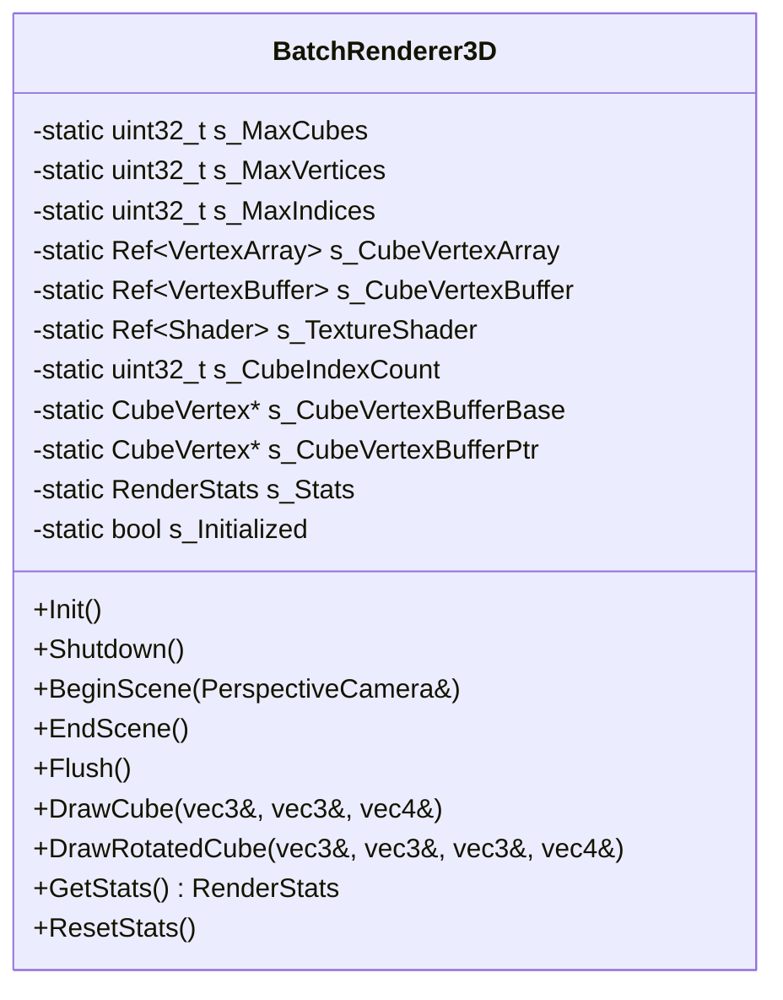
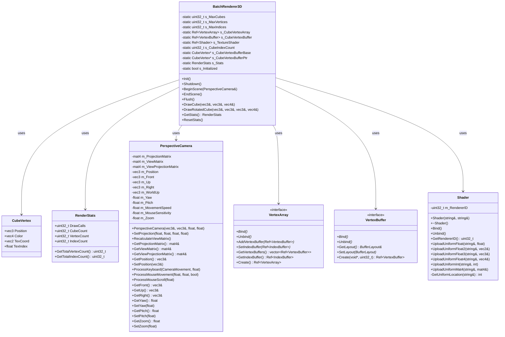
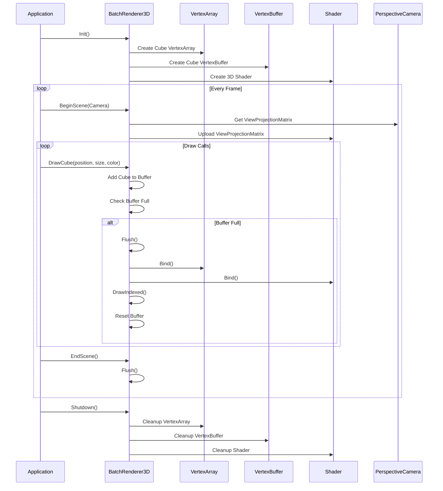

# BatchRenderer3D 类 UML 图

## BatchRenderer3D 类详细结构

## BatchRenderer3D 类关系图

## BatchRenderer3D 渲染流程图

## BatchRenderer3D 类说明

### 职责
- **3D渲染**: 高效的3D图元批处理渲染
- **立方体渲染**: 支持基本立方体和旋转立方体
- **3D变换**: 支持3D空间的位置、旋转和缩放
- **性能优化**: 通过批处理减少绘制调用

### 设计模式
- **单例模式**: 静态方法提供全局访问
- **批处理模式**: 将多个绘制操作合并为一次调用
- **对象池模式**: 使用预分配的顶点缓冲区

### 支持的图元
- **立方体**: 基本立方体绘制
- **旋转立方体**: 支持任意旋转的立方体
- **3D变换**: 支持位置、旋转、缩放变换

### 性能特性
- **批处理**: 将多个立方体合并为一次绘制调用
- **内存优化**: 使用预分配的顶点缓冲区
- **统计信息**: 提供详细的渲染统计
- **动态调整**: 支持运行时调整缓冲区大小

### 关键特性
- **高性能**: 优化的3D渲染管线
- **易用性**: 简单的API接口
- **3D支持**: 完整的3D空间支持
- **可扩展**: 易于添加新的3D图元类型
- **调试友好**: 提供详细的性能统计

### 与BatchRenderer2D的区别
- **相机类型**: 使用透视相机而非正交相机
- **图元类型**: 专注于3D立方体而非2D图元
- **变换支持**: 支持完整的3D变换矩阵
- **深度测试**: 支持深度测试和深度缓冲
