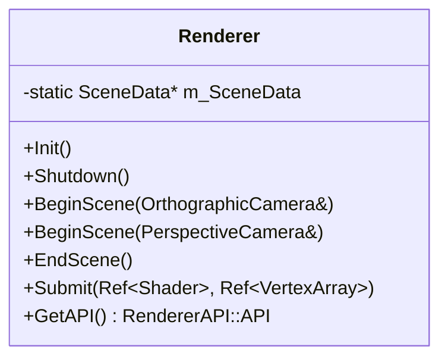
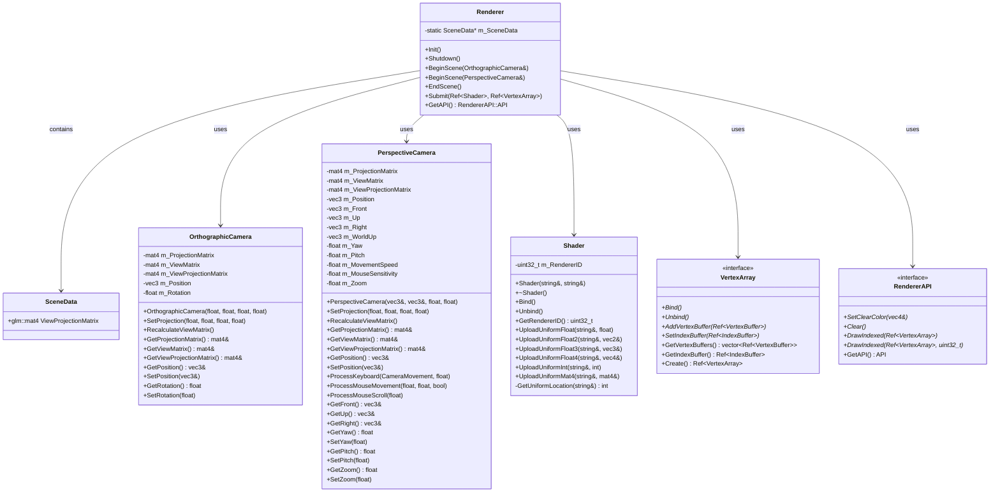
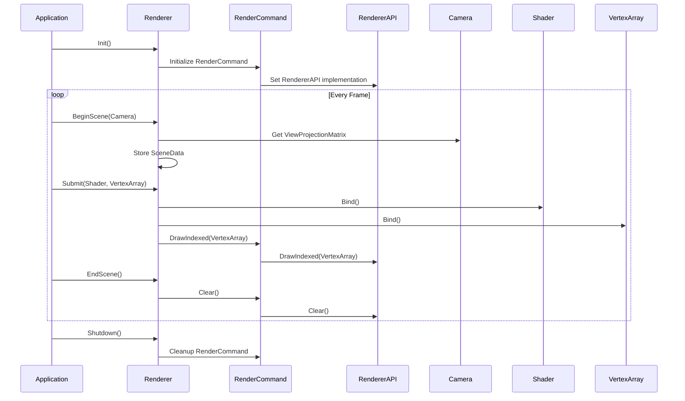

# Renderer 类 UML 图

## Renderer 类详细结构

## Renderer 类关系图

## Renderer 渲染流程图

## Renderer 类说明

### 职责
- **渲染管理**: 管理整个渲染流程
- **场景管理**: 管理场景数据和相机
- **绘制提交**: 提交绘制命令到渲染管线
- **API抽象**: 提供平台无关的渲染接口

### 设计模式
- **外观模式**: 提供简化的渲染接口
- **单例模式**: 静态方法提供全局访问
- **策略模式**: 支持不同的渲染API

### 渲染流程
1. **Init()**: 初始化渲染系统
2. **BeginScene()**: 开始场景渲染，设置相机
3. **Submit()**: 提交绘制命令
4. **EndScene()**: 结束场景渲染
5. **Shutdown()**: 清理渲染资源

### 关键特性
- **平台无关**: 通过RendererAPI抽象实现跨平台
- **高效渲染**: 优化的渲染管线
- **灵活相机**: 支持正交和透视相机
- **资源管理**: 自动管理渲染资源
- **错误处理**: 内置错误检查和报告
