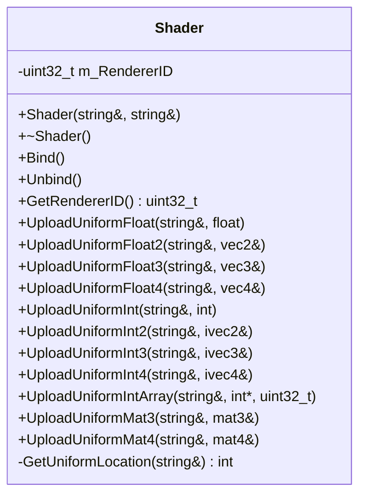
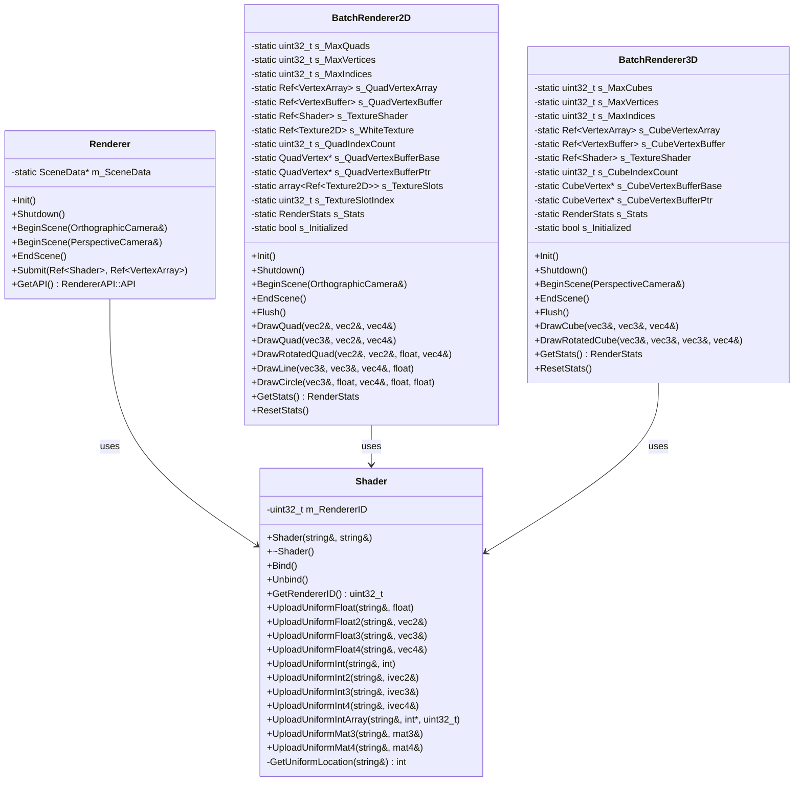
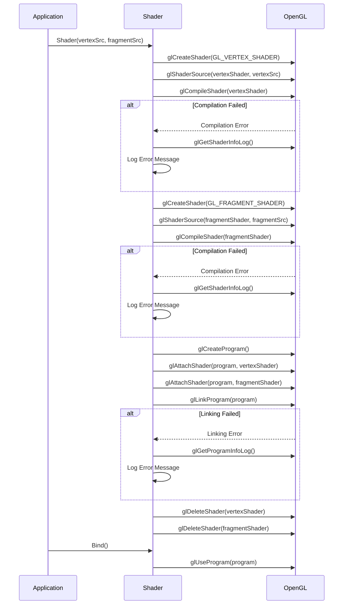
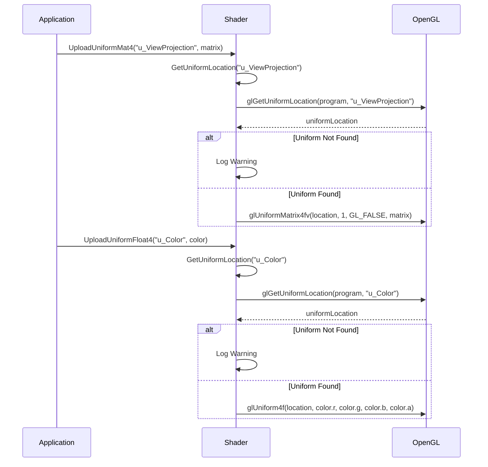

# Shader 类 UML 图

## Shader 类详细结构



## Shader 类关系图



## Shader 编译流程图



## Shader Uniform 上传流程图



## Shader 类说明

### 职责
- **着色器管理**: 管理GPU着色器程序的创建和销毁
- **编译链接**: 编译顶点和片段着色器并链接成程序
- **Uniform上传**: 提供类型安全的uniform变量上传接口
- **状态管理**: 管理着色器程序的绑定和解绑

### 设计模式
- **RAII模式**: 自动管理OpenGL资源生命周期
- **类型安全**: 提供类型安全的uniform上传接口
- **错误处理**: 内置编译和链接错误检查

### 支持的Uniform类型
- **标量**: float, int
- **向量**: vec2, vec3, vec4, ivec2, ivec3, ivec4
- **矩阵**: mat3, mat4
- **数组**: int数组

### 着色器类型
- **顶点着色器**: 处理顶点变换和属性
- **片段着色器**: 处理像素颜色和光照
- **几何着色器**: 支持几何图元生成 (预留)
- **计算着色器**: 支持通用计算 (预留)

### 关键特性
- **自动编译**: 自动编译和链接着色器程序
- **错误检查**: 完整的编译和链接错误检查
- **类型安全**: 类型安全的uniform上传接口
- **性能优化**: 缓存uniform位置避免重复查询
- **资源管理**: 自动清理OpenGL资源
- **调试支持**: 详细的错误日志和调试信息

### 使用示例
```cpp
// 创建着色器
auto shader = CreateRef<Shader>(vertexSource, fragmentSource);

// 绑定着色器
shader->Bind();

// 上传uniform变量
shader->UploadUniformMat4("u_ViewProjection", viewProjectionMatrix);
shader->UploadUniformFloat4("u_Color", glm::vec4(1.0f, 0.0f, 0.0f, 1.0f));
shader->UploadUniformInt("u_Texture", 0);

// 解绑着色器
shader->Unbind();
```
