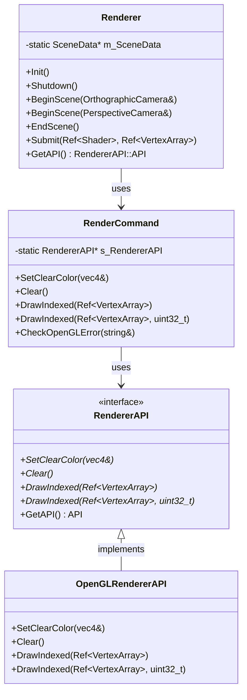
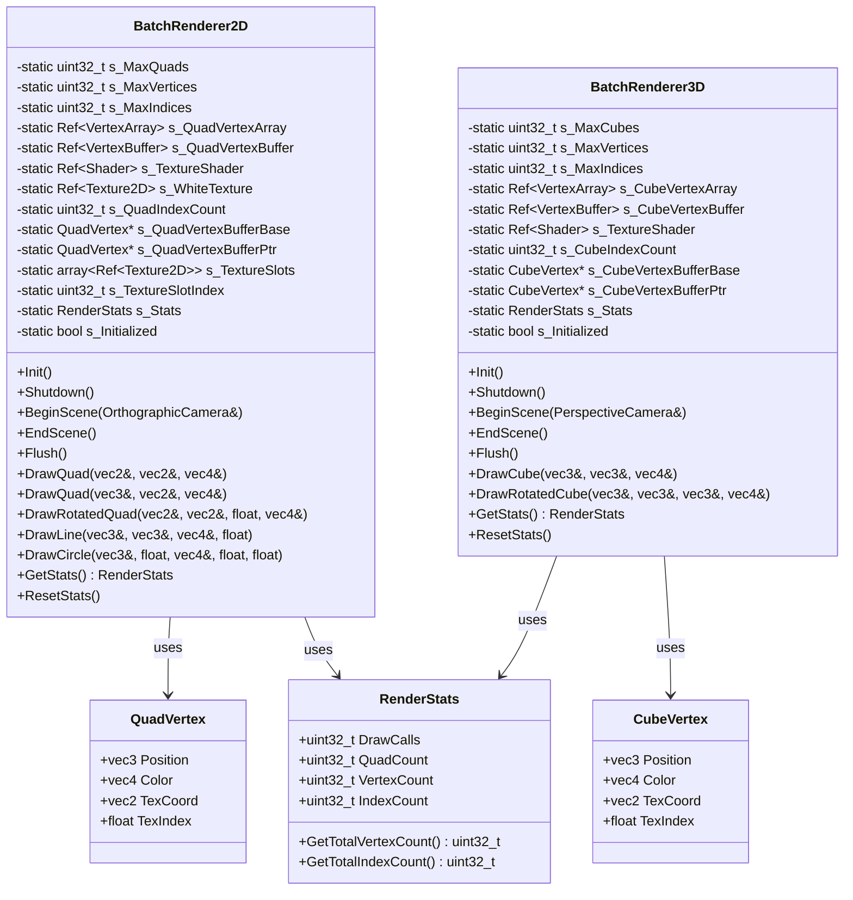
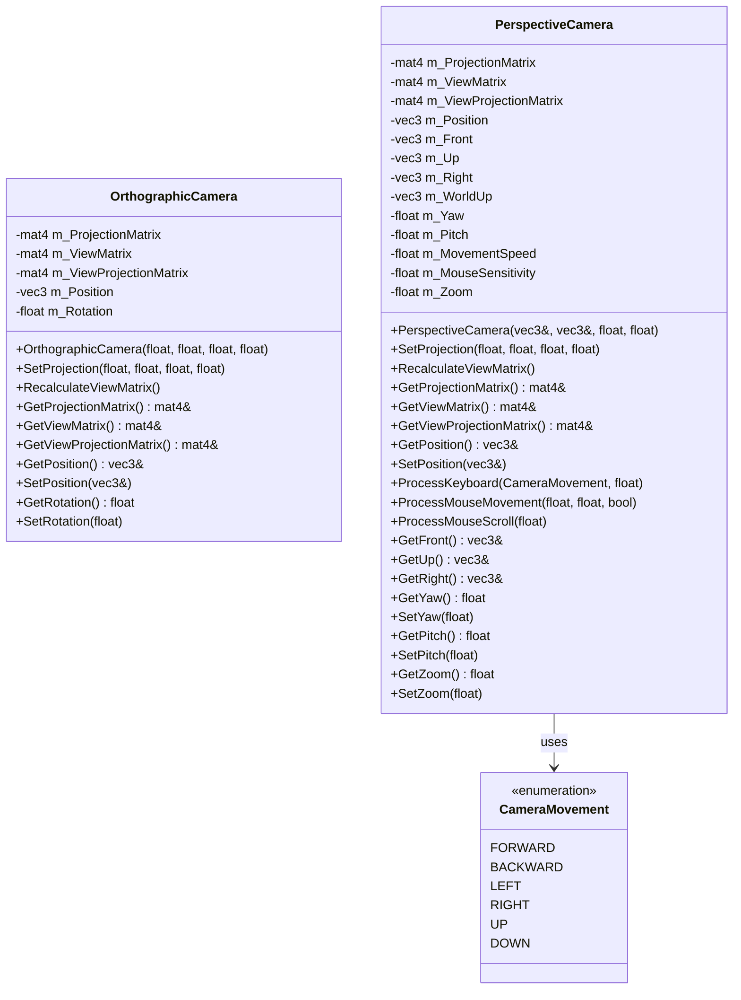
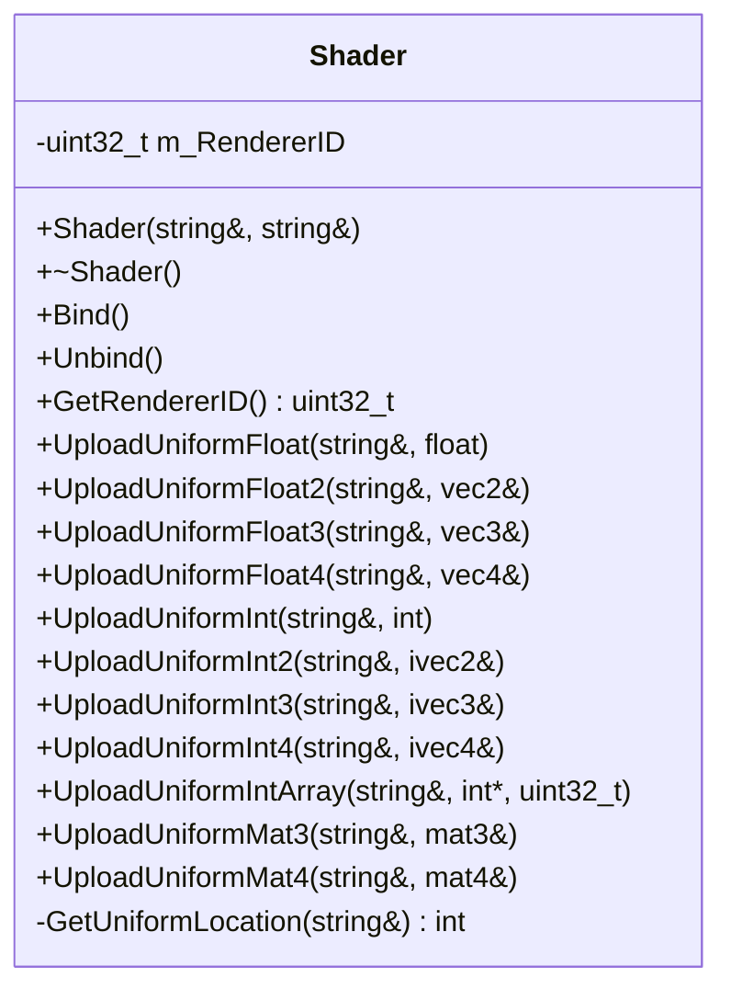
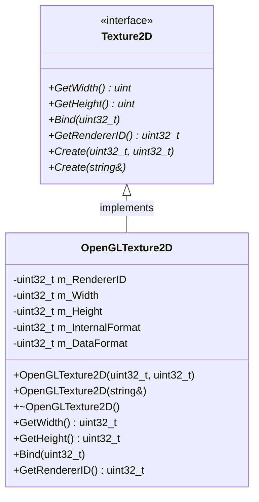
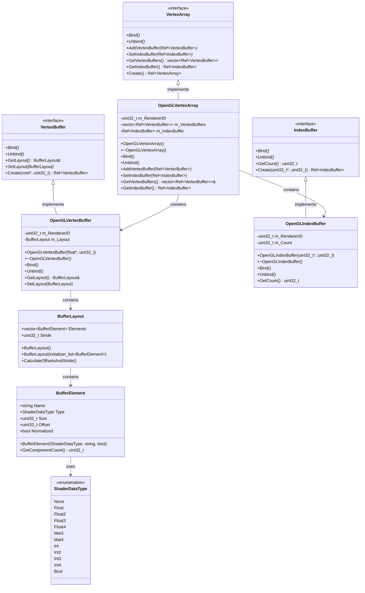
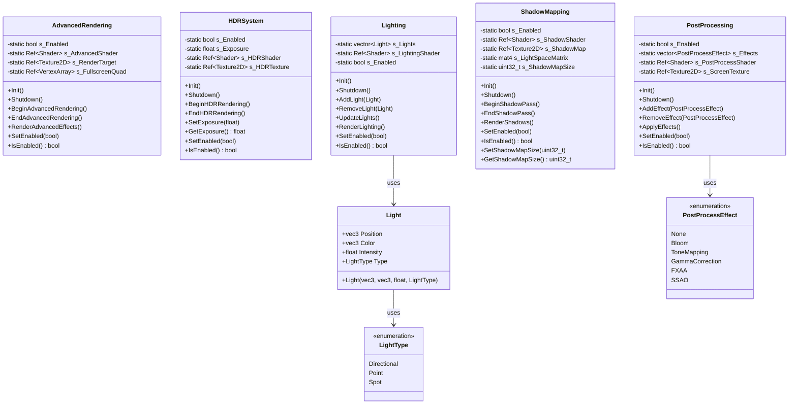
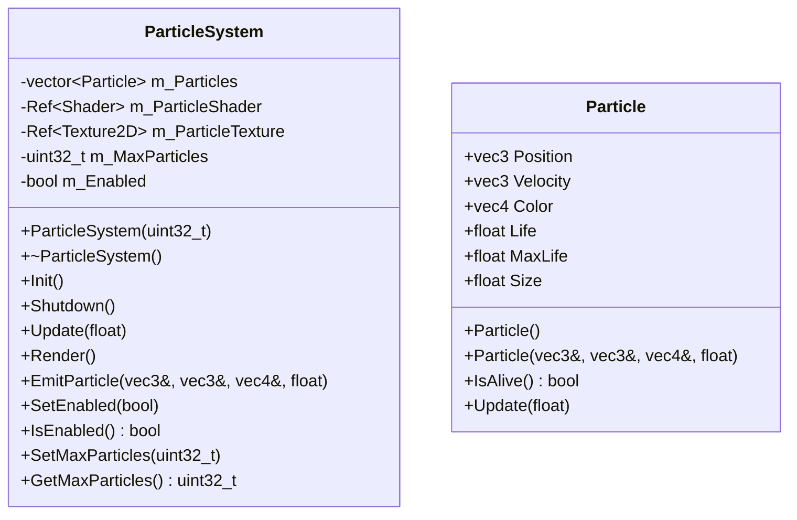
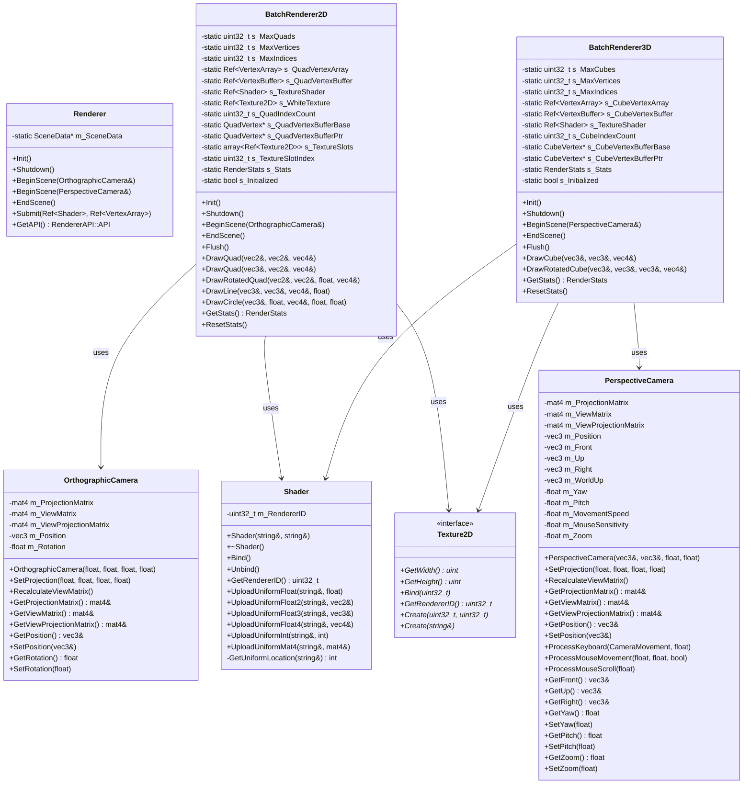

# 渲染系统 UML 类图

## 渲染核心类图

```mermaid
classDiagram
    class Renderer {
        -static SceneData* m_SceneData
        +Init()
        +Shutdown()
        +BeginScene(OrthographicCamera&)
        +BeginScene(PerspectiveCamera&)
        +EndScene()
        +Submit(Ref~Shader~, Ref~VertexArray~)
        +GetAPI() RendererAPI::API
    }

    class RenderCommand {
        -static RendererAPI* s_RendererAPI
        +SetClearColor(vec4&)
        +Clear()
        +DrawIndexed(Ref~VertexArray~)
        +DrawIndexed(Ref~VertexArray~, uint32_t)
        +CheckOpenGLError(string&)
    }

    class RendererAPI {
        <<interface>>
        +SetClearColor(vec4&)*
        +Clear()*
        +DrawIndexed(Ref~VertexArray~)*
        +DrawIndexed(Ref~VertexArray~, uint32_t)*
        +GetAPI() API
    }

    class OpenGLRendererAPI {
        +SetClearColor(vec4&)
        +Clear()
        +DrawIndexed(Ref~VertexArray~)
        +DrawIndexed(Ref~VertexArray~, uint32_t)
    }

    Renderer --> RenderCommand : uses
    RenderCommand --> RendererAPI : uses
    RendererAPI <|-- OpenGLRendererAPI : implements
```

## 批处理渲染器类图

```mermaid
classDiagram
    class BatchRenderer2D {
        -static uint32_t s_MaxQuads
        -static uint32_t s_MaxVertices
        -static uint32_t s_MaxIndices
        -static Ref~VertexArray~ s_QuadVertexArray
        -static Ref~VertexBuffer~ s_QuadVertexBuffer
        -static Ref~Shader~ s_TextureShader
        -static Ref~Texture2D~ s_WhiteTexture
        -static uint32_t s_QuadIndexCount
        -static QuadVertex* s_QuadVertexBufferBase
        -static QuadVertex* s_QuadVertexBufferPtr
        -static array~Ref~Texture2D~~ s_TextureSlots
        -static uint32_t s_TextureSlotIndex
        -static RenderStats s_Stats
        -static bool s_Initialized
        +Init()
        +Shutdown()
        +BeginScene(OrthographicCamera&)
        +EndScene()
        +Flush()
        +DrawQuad(vec2&, vec2&, vec4&)
        +DrawQuad(vec3&, vec2&, vec4&)
        +DrawRotatedQuad(vec2&, vec2&, float, vec4&)
        +DrawLine(vec3&, vec3&, vec4&, float)
        +DrawCircle(vec3&, float, vec4&, float, float)
        +GetStats() RenderStats
        +ResetStats()
    }

    class BatchRenderer3D {
        -static uint32_t s_MaxCubes
        -static uint32_t s_MaxVertices
        -static uint32_t s_MaxIndices
        -static Ref~VertexArray~ s_CubeVertexArray
        -static Ref~VertexBuffer~ s_CubeVertexBuffer
        -static Ref~Shader~ s_TextureShader
        -static uint32_t s_CubeIndexCount
        -static CubeVertex* s_CubeVertexBufferBase
        -static CubeVertex* s_CubeVertexBufferPtr
        -static RenderStats s_Stats
        -static bool s_Initialized
        +Init()
        +Shutdown()
        +BeginScene(PerspectiveCamera&)
        +EndScene()
        +Flush()
        +DrawCube(vec3&, vec3&, vec4&)
        +DrawRotatedCube(vec3&, vec3&, vec3&, vec4&)
        +GetStats() RenderStats
        +ResetStats()
    }

    class QuadVertex {
        +vec3 Position
        +vec4 Color
        +vec2 TexCoord
        +float TexIndex
    }

    class CubeVertex {
        +vec3 Position
        +vec4 Color
        +vec2 TexCoord
        +float TexIndex
    }

    class RenderStats {
        +uint32_t DrawCalls
        +uint32_t QuadCount
        +uint32_t VertexCount
        +uint32_t IndexCount
        +GetTotalVertexCount() uint32_t
        +GetTotalIndexCount() uint32_t
    }

    BatchRenderer2D --> QuadVertex : uses
    BatchRenderer3D --> CubeVertex : uses
    BatchRenderer2D --> RenderStats : uses
    BatchRenderer3D --> RenderStats : uses
```

## 相机系统类图

```mermaid
classDiagram
    class OrthographicCamera {
        -mat4 m_ProjectionMatrix
        -mat4 m_ViewMatrix
        -mat4 m_ViewProjectionMatrix
        -vec3 m_Position
        -float m_Rotation
        +OrthographicCamera(float, float, float, float)
        +SetProjection(float, float, float, float)
        +RecalculateViewMatrix()
        +GetProjectionMatrix() mat4&
        +GetViewMatrix() mat4&
        +GetViewProjectionMatrix() mat4&
        +GetPosition() vec3&
        +SetPosition(vec3&)
        +GetRotation() float
        +SetRotation(float)
    }

    class PerspectiveCamera {
        -mat4 m_ProjectionMatrix
        -mat4 m_ViewMatrix
        -mat4 m_ViewProjectionMatrix
        -vec3 m_Position
        -vec3 m_Front
        -vec3 m_Up
        -vec3 m_Right
        -vec3 m_WorldUp
        -float m_Yaw
        -float m_Pitch
        -float m_MovementSpeed
        -float m_MouseSensitivity
        -float m_Zoom
        +PerspectiveCamera(vec3&, vec3&, float, float)
        +SetProjection(float, float, float, float)
        +RecalculateViewMatrix()
        +GetProjectionMatrix() mat4&
        +GetViewMatrix() mat4&
        +GetViewProjectionMatrix() mat4&
        +GetPosition() vec3&
        +SetPosition(vec3&)
        +ProcessKeyboard(CameraMovement, float)
        +ProcessMouseMovement(float, float, bool)
        +ProcessMouseScroll(float)
        +GetFront() vec3&
        +GetUp() vec3&
        +GetRight() vec3&
        +GetYaw() float
        +SetYaw(float)
        +GetPitch() float
        +SetPitch(float)
        +GetZoom() float
        +SetZoom(float)
    }

    class CameraMovement {
        <<enumeration>>
        FORWARD
        BACKWARD
        LEFT
        RIGHT
        UP
        DOWN
    }

    PerspectiveCamera --> CameraMovement : uses
```

## 着色器系统类图

```mermaid
classDiagram
    class Shader {
        -uint32_t m_RendererID
        +Shader(string&, string&)
        +~Shader()
        +Bind()
        +Unbind()
        +GetRendererID() uint32_t
        +UploadUniformFloat(string&, float)
        +UploadUniformFloat2(string&, vec2&)
        +UploadUniformFloat3(string&, vec3&)
        +UploadUniformFloat4(string&, vec4&)
        +UploadUniformInt(string&, int)
        +UploadUniformInt2(string&, ivec2&)
        +UploadUniformInt3(string&, ivec3&)
        +UploadUniformInt4(string&, ivec4&)
        +UploadUniformIntArray(string&, int*, uint32_t)
        +UploadUniformMat3(string&, mat3&)
        +UploadUniformMat4(string&, mat4&)
        -GetUniformLocation(string&) int
    }
```

## 纹理系统类图

```mermaid
classDiagram
    class Texture2D {
        <<interface>>
        +GetWidth() uint*
        +GetHeight() uint*
        +Bind(uint32_t)*
        +GetRendererID() uint32_t*
        +Create(uint32_t, uint32_t)*
        +Create(string&)*
    }

    class OpenGLTexture2D {
        -uint32_t m_RendererID
        -uint32_t m_Width
        -uint32_t m_Height
        -uint32_t m_InternalFormat
        -uint32_t m_DataFormat
        +OpenGLTexture2D(uint32_t, uint32_t)
        +OpenGLTexture2D(string&)
        +~OpenGLTexture2D()
        +GetWidth() uint32_t
        +GetHeight() uint32_t
        +Bind(uint32_t)
        +GetRendererID() uint32_t
    }

    Texture2D <|-- OpenGLTexture2D : implements
```

## 顶点数组和缓冲区类图

```mermaid
classDiagram
    class VertexArray {
        <<interface>>
        +Bind()*
        +Unbind()*
        +AddVertexBuffer(Ref~VertexBuffer~)*
        +SetIndexBuffer(Ref~IndexBuffer~)*
        +GetVertexBuffers() vector~Ref~VertexBuffer~~
        +GetIndexBuffer() Ref~IndexBuffer~
        +Create() Ref~VertexArray~
    }

    class OpenGLVertexArray {
        -uint32_t m_RendererID
        -vector~Ref~VertexBuffer~~ m_VertexBuffers
        -Ref~IndexBuffer~ m_IndexBuffer
        +OpenGLVertexArray()
        +~OpenGLVertexArray()
        +Bind()
        +Unbind()
        +AddVertexBuffer(Ref~VertexBuffer~)
        +SetIndexBuffer(Ref~IndexBuffer~)
        +GetVertexBuffers() vector~Ref~VertexBuffer~~&
        +GetIndexBuffer() Ref~IndexBuffer~
    }

    class VertexBuffer {
        <<interface>>
        +Bind()*
        +Unbind()*
        +GetLayout() BufferLayout&*
        +SetLayout(BufferLayout)*
        +Create(void*, uint32_t) Ref~VertexBuffer~
    }

    class OpenGLVertexBuffer {
        -uint32_t m_RendererID
        -BufferLayout m_Layout
        +OpenGLVertexBuffer(float*, uint32_t)
        +~OpenGLVertexBuffer()
        +Bind()
        +Unbind()
        +GetLayout() BufferLayout&
        +SetLayout(BufferLayout)
    }

    class IndexBuffer {
        <<interface>>
        +Bind()*
        +Unbind()*
        +GetCount() uint32_t*
        +Create(uint32_t*, uint32_t) Ref~IndexBuffer~
    }

    class OpenGLIndexBuffer {
        -uint32_t m_RendererID
        -uint32_t m_Count
        +OpenGLIndexBuffer(uint32_t*, uint32_t)
        +~OpenGLIndexBuffer()
        +Bind()
        +Unbind()
        +GetCount() uint32_t
    }

    class BufferLayout {
        +vector~BufferElement~ Elements
        +uint32_t Stride
        +BufferLayout()
        +BufferLayout(initializer_list~BufferElement~)
        +CalculateOffsetsAndStride()
    }

    class BufferElement {
        +string Name
        +ShaderDataType Type
        +uint32_t Size
        +uint32_t Offset
        +bool Normalized
        +BufferElement(ShaderDataType, string, bool)
        +GetComponentCount() uint32_t
    }

    class ShaderDataType {
        <<enumeration>>
        None
        Float
        Float2
        Float3
        Float4
        Mat3
        Mat4
        Int
        Int2
        Int3
        Int4
        Bool
    }

    VertexArray <|-- OpenGLVertexArray : implements
    VertexBuffer <|-- OpenGLVertexBuffer : implements
    IndexBuffer <|-- OpenGLIndexBuffer : implements
    OpenGLVertexArray --> OpenGLVertexBuffer : contains
    OpenGLVertexArray --> OpenGLIndexBuffer : contains
    OpenGLVertexBuffer --> BufferLayout : contains
    BufferLayout --> BufferElement : contains
    BufferElement --> ShaderDataType : uses
```

## 高级渲染功能类图

```mermaid
classDiagram
    class AdvancedRendering {
        -static bool s_Enabled
        -static Ref~Shader~ s_AdvancedShader
        -static Ref~Texture2D~ s_RenderTarget
        -static Ref~VertexArray~ s_FullscreenQuad
        +Init()
        +Shutdown()
        +BeginAdvancedRendering()
        +EndAdvancedRendering()
        +RenderAdvancedEffects()
        +SetEnabled(bool)
        +IsEnabled() bool
    }

    class HDRSystem {
        -static bool s_Enabled
        -static float s_Exposure
        -static Ref~Shader~ s_HDRShader
        -static Ref~Texture2D~ s_HDRTexture
        +Init()
        +Shutdown()
        +BeginHDRRendering()
        +EndHDRRendering()
        +SetExposure(float)
        +GetExposure() float
        +SetEnabled(bool)
        +IsEnabled() bool
    }

    class PostProcessing {
        -static bool s_Enabled
        -static vector~PostProcessEffect~ s_Effects
        -static Ref~Shader~ s_PostProcessShader
        -static Ref~Texture2D~ s_ScreenTexture
        +Init()
        +Shutdown()
        +AddEffect(PostProcessEffect)
        +RemoveEffect(PostProcessEffect)
        +ApplyEffects()
        +SetEnabled(bool)
        +IsEnabled() bool
    }

    class ShadowMapping {
        -static bool s_Enabled
        -static Ref~Shader~ s_ShadowShader
        -static Ref~Texture2D~ s_ShadowMap
        -static mat4 s_LightSpaceMatrix
        -static uint32_t s_ShadowMapSize
        +Init()
        +Shutdown()
        +BeginShadowPass()
        +EndShadowPass()
        +RenderShadows()
        +SetEnabled(bool)
        +IsEnabled() bool
        +SetShadowMapSize(uint32_t)
        +GetShadowMapSize() uint32_t
    }

    class Lighting {
        -static vector~Light~ s_Lights
        -static Ref~Shader~ s_LightingShader
        -static bool s_Enabled
        +Init()
        +Shutdown()
        +AddLight(Light)
        +RemoveLight(Light)
        +UpdateLights()
        +RenderLighting()
        +SetEnabled(bool)
        +IsEnabled() bool
    }

    class Light {
        +vec3 Position
        +vec3 Color
        +float Intensity
        +LightType Type
        +Light(vec3, vec3, float, LightType)
    }

    class LightType {
        <<enumeration>>
        Directional
        Point
        Spot
    }

    class PostProcessEffect {
        <<enumeration>>
        None
        Bloom
        ToneMapping
        GammaCorrection
        FXAA
        SSAO
    }

    Lighting --> Light : uses
    Light --> LightType : uses
    PostProcessing --> PostProcessEffect : uses
```

## 粒子系统类图

```mermaid
classDiagram
    class ParticleSystem {
        -vector~Particle~ m_Particles
        -Ref~Shader~ m_ParticleShader
        -Ref~Texture2D~ m_ParticleTexture
        -uint32_t m_MaxParticles
        -bool m_Enabled
        +ParticleSystem(uint32_t)
        +~ParticleSystem()
        +Init()
        +Shutdown()
        +Update(float)
        +Render()
        +EmitParticle(vec3&, vec3&, vec4&, float)
        +SetEnabled(bool)
        +IsEnabled() bool
        +SetMaxParticles(uint32_t)
        +GetMaxParticles() uint32_t
    }

    class Particle {
        +vec3 Position
        +vec3 Velocity
        +vec4 Color
        +float Life
        +float MaxLife
        +float Size
        +Particle()
        +Particle(vec3&, vec3&, vec4&, float)
        +IsAlive() bool
        +Update(float)
    }
```

## 渲染系统关系图

```mermaid
classDiagram
    class Renderer {
        -static SceneData* m_SceneData
        +Init()
        +Shutdown()
        +BeginScene(OrthographicCamera&)
        +BeginScene(PerspectiveCamera&)
        +EndScene()
        +Submit(Ref~Shader~, Ref~VertexArray~)
        +GetAPI() RendererAPI::API
    }

    class BatchRenderer2D {
        -static uint32_t s_MaxQuads
        -static uint32_t s_MaxVertices
        -static uint32_t s_MaxIndices
        -static Ref~VertexArray~ s_QuadVertexArray
        -static Ref~VertexBuffer~ s_QuadVertexBuffer
        -static Ref~Shader~ s_TextureShader
        -static Ref~Texture2D~ s_WhiteTexture
        -static uint32_t s_QuadIndexCount
        -static QuadVertex* s_QuadVertexBufferBase
        -static QuadVertex* s_QuadVertexBufferPtr
        -static array~Ref~Texture2D~~ s_TextureSlots
        -static uint32_t s_TextureSlotIndex
        -static RenderStats s_Stats
        -static bool s_Initialized
        +Init()
        +Shutdown()
        +BeginScene(OrthographicCamera&)
        +EndScene()
        +Flush()
        +DrawQuad(vec2&, vec2&, vec4&)
        +DrawQuad(vec3&, vec2&, vec4&)
        +DrawRotatedQuad(vec2&, vec2&, float, vec4&)
        +DrawLine(vec3&, vec3&, vec4&, float)
        +DrawCircle(vec3&, float, vec4&, float, float)
        +GetStats() RenderStats
        +ResetStats()
    }

    class BatchRenderer3D {
        -static uint32_t s_MaxCubes
        -static uint32_t s_MaxVertices
        -static uint32_t s_MaxIndices
        -static Ref~VertexArray~ s_CubeVertexArray
        -static Ref~VertexBuffer~ s_CubeVertexBuffer
        -static Ref~Shader~ s_TextureShader
        -static uint32_t s_CubeIndexCount
        -static CubeVertex* s_CubeVertexBufferBase
        -static CubeVertex* s_CubeVertexBufferPtr
        -static RenderStats s_Stats
        -static bool s_Initialized
        +Init()
        +Shutdown()
        +BeginScene(PerspectiveCamera&)
        +EndScene()
        +Flush()
        +DrawCube(vec3&, vec3&, vec4&)
        +DrawRotatedCube(vec3&, vec3&, vec3&, vec4&)
        +GetStats() RenderStats
        +ResetStats()
    }

    class OrthographicCamera {
        -mat4 m_ProjectionMatrix
        -mat4 m_ViewMatrix
        -mat4 m_ViewProjectionMatrix
        -vec3 m_Position
        -float m_Rotation
        +OrthographicCamera(float, float, float, float)
        +SetProjection(float, float, float, float)
        +RecalculateViewMatrix()
        +GetProjectionMatrix() mat4&
        +GetViewMatrix() mat4&
        +GetViewProjectionMatrix() mat4&
        +GetPosition() vec3&
        +SetPosition(vec3&)
        +GetRotation() float
        +SetRotation(float)
    }

    class PerspectiveCamera {
        -mat4 m_ProjectionMatrix
        -mat4 m_ViewMatrix
        -mat4 m_ViewProjectionMatrix
        -vec3 m_Position
        -vec3 m_Front
        -vec3 m_Up
        -vec3 m_Right
        -vec3 m_WorldUp
        -float m_Yaw
        -float m_Pitch
        -float m_MovementSpeed
        -float m_MouseSensitivity
        -float m_Zoom
        +PerspectiveCamera(vec3&, vec3&, float, float)
        +SetProjection(float, float, float, float)
        +RecalculateViewMatrix()
        +GetProjectionMatrix() mat4&
        +GetViewMatrix() mat4&
        +GetViewProjectionMatrix() mat4&
        +GetPosition() vec3&
        +SetPosition(vec3&)
        +ProcessKeyboard(CameraMovement, float)
        +ProcessMouseMovement(float, float, bool)
        +ProcessMouseScroll(float)
        +GetFront() vec3&
        +GetUp() vec3&
        +GetRight() vec3&
        +GetYaw() float
        +SetYaw(float)
        +GetPitch() float
        +SetPitch(float)
        +GetZoom() float
        +SetZoom(float)
    }

    class Shader {
        -uint32_t m_RendererID
        +Shader(string&, string&)
        +~Shader()
        +Bind()
        +Unbind()
        +GetRendererID() uint32_t
        +UploadUniformFloat(string&, float)
        +UploadUniformFloat2(string&, vec2&)
        +UploadUniformFloat3(string&, vec3&)
        +UploadUniformFloat4(string&, vec4&)
        +UploadUniformInt(string&, int)
        +UploadUniformMat4(string&, mat4&)
        -GetUniformLocation(string&) int
    }

    class Texture2D {
        <<interface>>
        +GetWidth() uint*
        +GetHeight() uint*
        +Bind(uint32_t)*
        +GetRendererID() uint32_t*
        +Create(uint32_t, uint32_t)*
        +Create(string&)*
    }

    BatchRenderer2D --> OrthographicCamera : uses
    BatchRenderer3D --> PerspectiveCamera : uses
    BatchRenderer2D --> Shader : uses
    BatchRenderer3D --> Shader : uses
    BatchRenderer2D --> Texture2D : uses
    BatchRenderer3D --> Texture2D : uses
```
