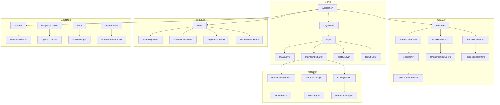

# Zgine 引擎 UML 类图总览

## 文档结构

本文档提供了 Zgine 引擎的完整 UML 类图总览。详细的类图已按架构模块分类存放在以下目录中：

### 📁 UML 类图目录结构

```
docs/architecture/uml/
├── core/                          # 核心架构 UML 类图
│   └── core-architecture.md       # Application、Layer、LayerStack、UIManager 等
├── renderer/                      # 渲染系统 UML 类图
│   └── renderer-system.md        # Renderer、BatchRenderer、Camera、Shader 等
├── events/                        # 事件系统 UML 类图
│   └── event-system.md           # Event、EventDispatcher、各种事件类型等
├── platform/                      # 平台抽象层 UML 类图
│   └── platform-abstraction.md  # Window、GraphicsContext、Input、RendererAPI 等
├── performance/                   # 性能监控系统 UML 类图
│   └── performance-monitoring.md # PerformanceProfiler、MemoryManager、CullingSystem 等
└── uml-class-diagrams.md         # 本文档 - UML 类图总览
```

## 核心架构模块

### 🏗️ 应用程序核心
- **Application**: 主应用程序类，管理整个引擎生命周期
- **Layer**: 所有应用层的基类
- **LayerStack**: 管理应用层的栈结构
- **ImGuiLayer**: ImGui 调试界面层
- **SandboxApp**: 测试应用实现

**详细类图**: [核心架构 UML 类图](core/core-architecture.md)

### 🎨 渲染系统
- **Renderer**: 高级渲染接口
- **RenderCommand**: 渲染命令抽象
- **RendererAPI**: 渲染 API 抽象基类
- **BatchRenderer2D/3D**: 批处理渲染器
- **Camera**: 正交和透视相机
- **Shader**: 着色器管理
- **Texture**: 纹理系统
- **VertexArray/Buffer**: 顶点数组和缓冲区

**详细类图**: [渲染系统 UML 类图](renderer/renderer-system.md)

### 📡 事件系统
- **Event**: 事件基类
- **EventDispatcher**: 事件分发器
- **Application Events**: 窗口事件、应用事件
- **Input Events**: 键盘事件、鼠标事件
- **KeyCodes/MouseButtonCodes**: 按键码定义

**详细类图**: [事件系统 UML 类图](events/event-system.md)

### 🖥️ 平台抽象层
- **Window**: 窗口抽象接口
- **GraphicsContext**: 图形上下文抽象
- **Input**: 输入抽象接口
- **RendererAPI**: 渲染 API 抽象
- **Buffer**: 缓冲区抽象
- **OpenGL 实现**: OpenGL 平台特定实现
- **Direct3D 实现**: Direct3D 平台特定实现 (预留)

**详细类图**: [平台抽象层 UML 类图](platform/platform-abstraction.md)

### ⚡ 性能监控系统
- **PerformanceProfiler**: 性能分析器
- **PerformanceBenchmark**: 性能基准测试
- **PerformanceMonitorUI**: 性能监控 UI
- **MemoryManager**: 内存管理器
- **ObjectPool**: 对象池
- **CullingSystem**: 剔除系统
- **ResourceManager**: 资源管理器

**详细类图**: [性能监控系统 UML 类图](performance/performance-monitoring.md)

## 整体架构关系



## 设计模式应用

### 🎯 单例模式
- `Application`: 应用程序单例
- `PerformanceProfiler`: 性能分析器单例
- `MemoryManager`: 内存管理器单例

### 🏭 工厂模式
- `Window::Create()`: 创建平台特定窗口
- `VertexArray::Create()`: 创建顶点数组
- `Texture2D::Create()`: 创建纹理

### 👀 观察者模式
- 事件系统: `Event` → `EventDispatcher` → 事件处理器

### 🎨 策略模式
- 渲染 API: `RendererAPI` → `OpenGLRendererAPI` / `Direct3DRendererAPI`
- 输入系统: `Input` → `WindowsInput`

### 📋 命令模式
- `RenderCommand`: 渲染命令封装

### 🏗️ 建造者模式
- `BufferLayout`: 缓冲区布局构建

## 性能优化特性

### 🚀 批处理渲染
- **BatchRenderer2D**: 2D 图元批处理
- **BatchRenderer3D**: 3D 图元批处理
- **纹理批处理**: 多纹理合并渲染

### 💾 内存优化
- **ObjectPool**: 对象池复用
- **RingBuffer**: 环形缓冲区
- **MemoryManager**: 内存跟踪和管理

### 🎯 渲染优化
- **CullingSystem**: 视锥剔除
- **LOD 系统**: 细节层次 (预留)
- **遮挡剔除**: 遮挡剔除 (预留)

### 📊 性能监控
- **实时性能监控**: FPS、帧时间、内存使用
- **性能分析**: 函数调用时间分析
- **基准测试**: 性能基准测试

## 扩展性设计

### 🔌 插件系统
- 通过 `Layer` 系统支持插件
- 事件系统支持自定义事件类型

### 🌐 多平台支持
- 平台抽象层设计
- 支持 Windows、Linux、macOS (预留)

### 🎮 多渲染 API
- 支持 OpenGL、Direct3D、Vulkan (预留)
- 渲染 API 抽象层

### 📦 模块化设计
- 各模块独立，便于替换和扩展
- 清晰的接口定义

## 技术栈

- **语言**: C++17
- **构建系统**: Premake5
- **渲染 API**: OpenGL 3.3+
- **窗口管理**: GLFW
- **UI 框架**: ImGui
- **数学库**: GLM
- **日志系统**: spdlog
- **图像加载**: stb_image

## 总结

Zgine 引擎采用了现代化的 C++ 设计模式，具有以下特点：

1. **分层架构**: 清晰的层次结构，每层职责明确
2. **平台抽象**: 通过接口实现跨平台支持
3. **事件驱动**: 基于事件系统的松耦合设计
4. **模块化**: 各功能模块独立，便于维护和扩展
5. **性能优化**: 内置批处理渲染、内存池、剔除系统等优化
6. **可扩展性**: 支持插件系统和多渲染 API

该架构设计为游戏开发提供了坚实的基础，支持 2D 和 3D 渲染，具有良好的性能和可维护性。

---

**注意**: 本文档提供了 UML 类图的总览，详细的类图请参考各个模块的专门文档。
