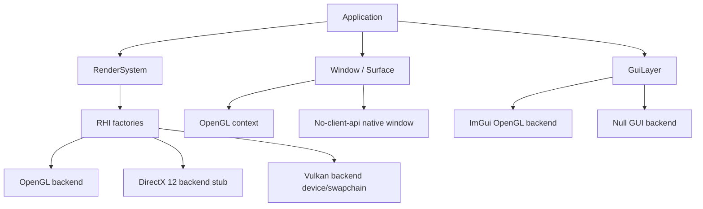

# Zgine Rendering Backend Plan

Date: 2026-05-23

Zgine is a teaching engine. The renderer architecture should expose the core ideas behind
multiple graphics APIs without hiding everything behind a production-grade abstraction too early.

## Current Status

| Backend | Status | Meaning |
|---------|--------|---------|
| OpenGL | Implemented | Default backend. Window context, RHI objects, shaders, framebuffers, post-process, ImGui, and the editor app use OpenGL. |
| DirectX 12 | Selectable stub | The engine can select the backend and create a no-client-api window, but RHI resources deliberately fail with a clear unsupported message. The editor disables rendering for this backend until a real device/swapchain path exists. |
| Vulkan | Device/swapchain skeleton | CMake finds the Vulkan SDK, the backend creates an instance, debug messenger, GLFW surface, physical/logical device, queues, swapchain, and image views. RHI resources, command buffers, pipelines, and presentation are still intentionally incomplete. |
| None | Headless stub | Useful for non-rendering tests and future server/tool scenarios. |

## Backend Selection

CMake controls the default backend:

```powershell
cmake -S . -B build\opengl -G Ninja -DZGINE_RENDERER_BACKEND=OpenGL
cmake -S . -B build\dx12-study -G Ninja -DZGINE_RENDERER_BACKEND=DirectX12
cmake -S . -B build\vulkan-study -G Ninja -DZGINE_RENDERER_BACKEND=Vulkan
```

Valid values:

- `OpenGL`
- `DirectX12`
- `Vulkan`
- `None`

Runtime code can also call:

```cpp
RendererAPI::SetAPI(RendererAPI::API::OpenGL);
RendererAPI::SetAPI(RendererAPI::API::DirectX12);
RendererAPI::SetAPI(RendererAPI::API::Vulkan);
```

Set the backend before `Application`, `Window`, `GuiLayer`, or any RHI resource is created.

## Architecture



## Teaching Implementation Order

### Stage 1: RHI Boundary

Already started.

- `RendererAPI::API` names the supported backend choices.
- RHI factories switch on the selected backend.
- Unsupported backends return `nullptr` and log explicitly.
- `Window` can create an OpenGL context or a no-client-api native window.
- `GuiLayer` falls back to `NullGuiLayer` when the selected backend has no ImGui renderer.
- `ZgineEditor` is guarded as OpenGL-only for now, so selecting a stub backend does not crash through the old OpenGL framebuffer path.

### Stage 2: Backend Device and Swapchain

Started for Vulkan.

- Done for Vulkan: instance, validation debug messenger, surface, physical device selection, logical device, graphics/present queues, swapchain, and image views.
- Still missing for Vulkan: command pool, command buffers, render pass or dynamic rendering setup, frame sync objects, acquire/present, and resize recreation.
- Still missing for DirectX 12: all device/swapchain objects.

For teaching, keep this visible and simple. Do not introduce a render graph yet.

### Stage 3: Resource Objects

Implement resources in this order:

1. Vertex buffer and index buffer.
2. Shader module / pipeline state.
3. Texture.
4. Framebuffer or render target abstraction.
5. Sampler and descriptor binding.

DirectX 12 and Vulkan should each get their own implementation files. Vulkan implementation
details currently live in `src/Renderer/Backend/Vulkan/**`. Do not put API-specific types in
public `include/Zgine/Renderer/RHI/**` headers.

### Stage 4: Shader Pipeline

OpenGL currently uses GLSL directly. DirectX 12 and Vulkan need a shader cross-compilation plan:

- Teaching path: write backend-specific shader files first.
- Later path: introduce SPIR-V/HLSL tooling once the API mechanics are understood.

### Stage 5: GUI Backend

OpenGL uses `imgui_impl_opengl3`. DirectX 12 and Vulkan need their own ImGui backend setup:

- DirectX 12: descriptor heap for ImGui.
- Vulkan: render pass or dynamic rendering setup, descriptor pool, and frame resources.

Editor support should wait until the runtime sample can render a triangle or cube through that backend.

## Rules

- OpenGL remains the reference implementation.
- DirectX 12 and incomplete Vulkan resource paths must not silently no-op as if they were complete.
- Backend-specific includes stay in `src/Renderer/Backend/<API>/**`.
- Public RHI headers expose Zgine types, not `ID3D12*`, `Vk*`, or OpenGL IDs except where the old teaching OpenGL path still exposes texture IDs.
- Tests should validate backend selection and unsupported behavior before real resources are implemented.
